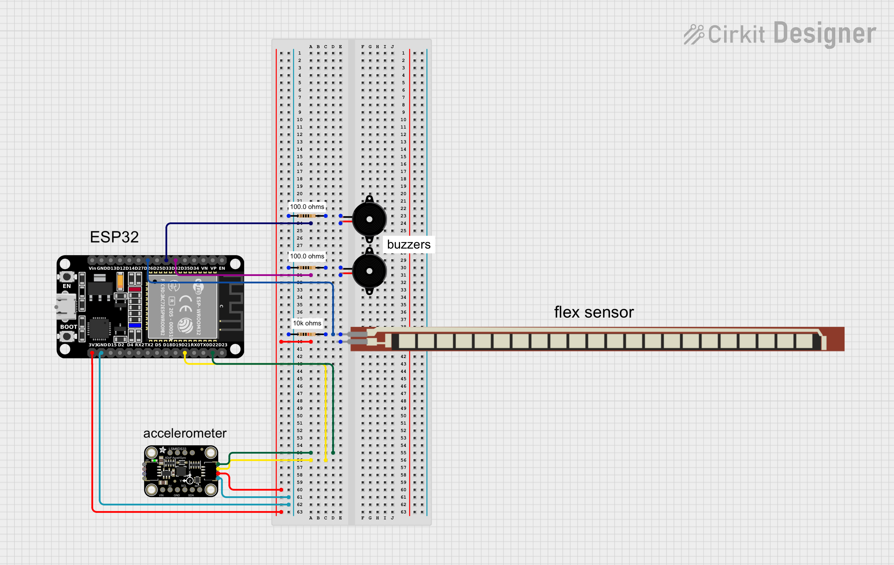

# Knee Rehabilitation Device
<!--
Replace this text with a brief description (2-3 sentences) of your project. This description should draw the reader in and make them interested in what you've built. You can include what the biggest challenges, takeaways, and triumphs from completing the project were. As you complete your portfolio, remember your audience is less familiar than you are with all that your project entails!
-->

| Pratiksha S | Lynbrook High School | Computer Science | Rising Junior |


# Final Milestone
<!--
**Don't forget to replace the text below with the embedding for your milestone video. Go to Youtube, click Share -> Embed, and copy and paste the code to replace what's below.**

<iframe width="560" height="315" src="https://www.youtube.com/embed/F7M7imOVGug" title="YouTube video player" frameborder="0" allow="accelerometer; autoplay; clipboard-write; encrypted-media; gyroscope; picture-in-picture; web-share" allowfullscreen></iframe>

For your final milestone, explain the outcome of your project. Key details to include are:
- What you've accomplished since your previous milestone
- What your biggest challenges and triumphs were at BSE
- A summary of key topics you learned about
- What you hope to learn in the future after everything you've learned at BSE

-->

# Second Milestone
<!--
**Don't forget to replace the text below with the embedding for your milestone video. Go to Youtube, click Share -> Embed, and copy and paste the code to replace what's below.**

<iframe width="560" height="315" src="https://www.youtube.com/embed/y3VAmNlER5Y" title="YouTube video player" frameborder="0" allow="accelerometer; autoplay; clipboard-write; encrypted-media; gyroscope; picture-in-picture; web-share" allowfullscreen></iframe>

For your second milestone, explain what you've worked on since your previous milestone. You can highlight:
- Technical details of what you've accomplished and how they contribute to the final goal
- What has been surprising about the project so far
- Previous challenges you faced that you overcame
- What needs to be completed before your final milestone 
-->
# First Milestone
<!--
**Don't forget to replace the text below with the embedding for your milestone video. Go to Youtube, click Share -> Embed, and copy and paste the code to replace what's below.**

<iframe width="560" height="315" src="https://www.youtube.com/embed/CaCazFBhYKs" title="YouTube video player" frameborder="0" allow="accelerometer; autoplay; clipboard-write; encrypted-media; gyroscope; picture-in-picture; web-share" allowfullscreen></iframe>

For your first milestone, describe what your project is and how you plan to build it. You can include:
- An explanation about the different components of your project and how they will all integrate together
- Technical progress you've made so far
- Challenges you're facing and solving in your future milestones
- What your plan is to complete your project
-->

## Description
  My first milestone was to learn how to calibrate a flex sensor, an accelerometer, and buzzers with an ESP32. When the flex sensor's flexADC value is below a certain number (approximately what looks like 90 degrees to the naked eye), one buzzer will buzz continuously and the serial monitor prints out "Flex Sensor: Bad form detected!" I also tried sampling the data the flex sensor was outputing in attempt to make the data more accurate. When the adafruit accelerometer's X-axis acceleration value is below a certain number, another buzzer will buzz in a different patternand the serial monitor prints out "Accelerometer: Bad form detected!" I also learned how to print out the outputs that were originally displayed on the Serial Monitor onto an app on my phone.
## Challenges
  Calibrating the accelerometer was one of the biggest challenges for me. The example code for the Adafruit LSM6DS3+LIS3MDL Accelerometer provided by Arduino IDE did not work as it was, so I had to tweak it a bit. I also figured out that a 9600 baud rate wasn't suitable and would either print out random symbols onto the serial monitor or nothing at all, so I changed all my code to begin the serial with a 112500 baud rate.
## Next Steps
  The thresholds that I have currently initialized for the flex sensor and the accelerometer are estimates I defined based on the naked eye, so my next steps would be to make these thresholds more accurate by temporarily taping all of my components to a knee brace, creating a prototype.
## Schematic

## Code
### Flex Sensor
```c++

const int flexPin = 26;
const int flexBuzzer = 33;
const int num = 10; // sampling every 10 data points

void setup() {
  Serial.begin(9600);
  pinMode(flexPin, INPUT);
  pinMode(flexBuzzer, OUTPUT);
}

void loop() {
  int sum = 0;
  for (int i = 0; i < num; i++) {
    sum += analogRead(flexPin);
    delay(10);
  }

  int flexADC = sum/num; // find average of values to determinee more accuratee data points

  if (flexADC < 620) { // threshold will be made more accurate in next milestone
    tone(flexBuzzer, 1000); // buzzer plays
  } else {
    noTone(flexBuzzer);
  }

  Serial.println(flexADC); // print values of flex sensor

  delay(500);
}
```

### Accelerometer
```c++
#include <Adafruit_BusIO_Register.h>
#include <Adafruit_GenericDevice.h>
#include <Adafruit_I2CDevice.h>
#include <Adafruit_I2CRegister.h>
#include <Adafruit_SPIDevice.h>

#include <Adafruit_LIS3MDL.h>

#include <Adafruit_ISM330DHCX.h>
#include <Adafruit_LSM6DS.h>
#include <Adafruit_LSM6DS3.h>
#include <Adafruit_LSM6DS33.h>
#include <Adafruit_LSM6DS3TRC.h>
#include <Adafruit_LSM6DSL.h>
#include <Adafruit_LSM6DSO32.h>
#include <Adafruit_LSM6DSOX.h>

#include <Adafruit_Sensor.h>

#include <BleSerial.h>

// Basic demo for accelerometer/gyro readings from Adafruit LSM6DS33

// For SPI mode, we need a CS pin
#define LSM_CS 10
// For software-SPI mode we need SCK/MOSI/MISO pins
#define LSM_SCK 13
#define LSM_MISO 12
#define LSM_MOSI 11

Adafruit_LSM6DS33 lsm6ds33;

const int accelBuzzer = 32;
const int flexPin = 26;
const int flexBuzzer = 33;
const int num = 10; // for samplng data
const int flexADCThreshold = 620;

void setup(void) {
  Serial.begin(115200);
  pinMode(accelBuzzer, OUTPUT);
  pinMode(flexPin, INPUT);
  pinMode(flexBuzzer, OUTPUT);
  

  while (!Serial)
    delay(10); // will pause Zero, Leonardo, etc until serial console opens

  Serial.println("Adafruit LSM6DS33 test!");

  // find accelerometer chips
  if (lsm6ds33.begin_I2C()) {
    Serial.println("Finding LSM6DS33 chip");
    while (1) {
      delay(10);
    }
  }

  Serial.println("LSM6DS33 Found!");

  // set range of accelerometer
  lsm6ds33.setAccelRange(LSM6DS_ACCEL_RANGE_2_G);
  Serial.print("Accelerometer range set to: ");
  switch (lsm6ds33.getAccelRange()) {
  case LSM6DS_ACCEL_RANGE_2_G:
    Serial.println("+-2G");
    break;
  case LSM6DS_ACCEL_RANGE_4_G:
    Serial.println("+-4G");
    break;
  case LSM6DS_ACCEL_RANGE_8_G:
    Serial.println("+-8G");
    break;
  case LSM6DS_ACCEL_RANGE_16_G:
    Serial.println("+-16G");
    break;
  }

  // set range of gyroscope
  lsm6ds33.setGyroRange(LSM6DS_GYRO_RANGE_250_DPS);
  Serial.print("Gyro range set to: ");
  switch (lsm6ds33.getGyroRange()) {
  case LSM6DS_GYRO_RANGE_125_DPS:
    Serial.println("125 degrees/s");
    break;
  case LSM6DS_GYRO_RANGE_250_DPS:
    Serial.println("250 degrees/s");
    break;
  case LSM6DS_GYRO_RANGE_500_DPS:
    Serial.println("500 degrees/s");
    break;
  case LSM6DS_GYRO_RANGE_1000_DPS:
    Serial.println("1000 degrees/s");
    break;
  case LSM6DS_GYRO_RANGE_2000_DPS:
    Serial.println("2000 degrees/s");
    break;
  case ISM330DHCX_GYRO_RANGE_4000_DPS:
    break; // unsupported range for the DS33
  }

  // set accelerometer data rate
  lsm6ds33.setAccelDataRate(LSM6DS_RATE_12_5_HZ);
  Serial.print("Accelerometer data rate set to: ");
  switch (lsm6ds33.getAccelDataRate()) {
  case LSM6DS_RATE_SHUTDOWN:
    Serial.println("0 Hz");
    break;
  case LSM6DS_RATE_12_5_HZ:
    Serial.println("12.5 Hz");
    break;
  case LSM6DS_RATE_26_HZ:
    Serial.println("26 Hz");
    break;
  case LSM6DS_RATE_52_HZ:
    Serial.println("52 Hz");
    break;
  case LSM6DS_RATE_104_HZ:
    Serial.println("104 Hz");
    break;
  case LSM6DS_RATE_208_HZ:
    Serial.println("208 Hz");
    break;
  case LSM6DS_RATE_416_HZ:
    Serial.println("416 Hz");
    break;
  case LSM6DS_RATE_833_HZ:
    Serial.println("833 Hz");
    break;
  case LSM6DS_RATE_1_66K_HZ:
    Serial.println("1.66 KHz");
    break;
  case LSM6DS_RATE_3_33K_HZ:
    Serial.println("3.33 KHz");
    break;
  case LSM6DS_RATE_6_66K_HZ:
    Serial.println("6.66 KHz");
    break;
  }

  // set gyroscope data rate
  lsm6ds33.setGyroDataRate(LSM6DS_RATE_12_5_HZ);
  Serial.print("Gyro data rate set to: ");
  switch (lsm6ds33.getGyroDataRate()) {
  case LSM6DS_RATE_SHUTDOWN:
    Serial.println("0 Hz");
    break;
  case LSM6DS_RATE_12_5_HZ:
    Serial.println("12.5 Hz");
    break;
  case LSM6DS_RATE_26_HZ:
    Serial.println("26 Hz");
    break;
  case LSM6DS_RATE_52_HZ:
    Serial.println("52 Hz");
    break;
  case LSM6DS_RATE_104_HZ:
    Serial.println("104 Hz");
    break;
  case LSM6DS_RATE_208_HZ:
    Serial.println("208 Hz");
    break;
  case LSM6DS_RATE_416_HZ:
    Serial.println("416 Hz");
    break;
  case LSM6DS_RATE_833_HZ:
    Serial.println("833 Hz");
    break;
  case LSM6DS_RATE_1_66K_HZ:
    Serial.println("1.66 KHz");
    break;
  case LSM6DS_RATE_3_33K_HZ:
    Serial.println("3.33 KHz");
    break;
  case LSM6DS_RATE_6_66K_HZ:
    Serial.println("6.66 KHz");
    break;
  }

  lsm6ds33.configInt1(false, false, true); // accelerometer DRDY on INT1
  lsm6ds33.configInt2(false, true, false); // gyro DRDY on INT2
}

void loop() {
  sensors_event_t accel;
  sensors_event_t gyro;
  sensors_event_t temp;
  lsm6ds33.getEvent(&accel, &gyro, &temp);

  Serial.print("\t\tTemperature ");
  Serial.print(temp.temperature);
  Serial.println(" deg C");

  /* Display the results (acceleration is measured in m/s^2) */
  Serial.print("\t\tAccel X: ");
  Serial.print(accel.acceleration.x);
  Serial.print(" \tY: ");
  Serial.print(accel.acceleration.y);
  Serial.print(" \tZ: ");
  Serial.print(accel.acceleration.z);
  Serial.println(" m/s^2 ");

  /* Display the results (rotation is measured in rad/s) */
  Serial.print("\t\tGyro X: ");
  Serial.print(gyro.gyro.x);
  Serial.print(" \tY: ");
  Serial.print(gyro.gyro.y);
  Serial.print(" \tZ: ");
  Serial.print(gyro.gyro.z);
  Serial.println(" radians/s ");

  delay(100);


  float accelXThreshold = -0.40; // estimated threshold

  bool badForm = false;

  if (accel.acceleration.x < accelXThreshold) {
    badForm = true;
  }

  if (badForm == true) {
    // buzzer pattern for accelerometer
    tone(accelBuzzer, 1000);
    Serial.println("\t\tAccelerometer: Bad form detected!");
    Serial.println();
    delay(250);   
    noTone(accelBuzzer);
    delay(100);
    tone(accelBuzzer, 1000);
    delay(250);          
    noTone(accelBuzzer);
    delay(500);
  } else {
    noTone(accelBuzzer);
  }

  delay(500);
}
```

# Starter Project Milestone

<iframe width="560" height="315" src="https://www.youtube.com/embed/OkP_cfM5t3o?si=ZXIxwUmzVvw81dvx" title="YouTube video player" frameborder="0" allow="accelerometer; autoplay; clipboard-write; encrypted-media; gyroscope; picture-in-picture; web-share" referrerpolicy="strict-origin-when-cross-origin" allowfullscreen></iframe>

## Description
  My starter project was the Jitterbug. It used a lithium battery to power the device, a vibration motor that turns on using a switch system, two red LED lights, and metal wire for the legs of the Jitterbug. These pieces were mounted and soldered together on a circuit board. When the switch is turned on, the current within the board is able to flow from the battery, powering the LED lights and the vibration motor. The Jitterbug then moves in a circular motion on smooth surfaces.
## Challenges
  I faced numerous challenges while working on this project. I had a lot of trouble soldering the pieces together properly. When I was soldering the wires of the vibration motor, I accidentally created a short between them. I figured this out after using a multimeter by measuring the resistance between the two joints. So, I learned how to desolder the short using the desoldering pump. Eventually, I figured out that my soldering iron wasn't working well, so I switched to a new one, which made soldering much more easy and neat. As someone who has no experience in working with hardware, I found this project a little confusing at first, but I ended up learning a lot by the time I was finished. 
## Next Steps
  This project allowed me to gain significant experience in soldering and wiring logic. I will be needing these skills for my next step--my intensive project, the knee rehabilitation device.

# Schematics 
<!--
Here's where you'll put images of your schematics. [Tinkercad](https://www.tinkercad.com/blog/official-guide-to-tinkercad-circuits) and [Fritzing](https://fritzing.org/learning/) are both great resoruces to create professional schematic diagrams, though BSE recommends Tinkercad becuase it can be done easily and for free in the browser. 
-->
# Code
<!--
Here's where you'll put your code. The syntax below places it into a block of code. Follow the guide [here]([url](https://www.markdownguide.org/extended-syntax/)) to learn how to customize it to your project needs. 
```c++
void setup() {
  // put your setup code here, to run once:
  Serial.begin(9600);
  Serial.println("Hello World!");
}

void loop() {
  // put your main code here, to run repeatedly:

}
```
-->

# Bill of Materials
<!--
Here's where you'll list the parts in your project. To add more rows, just copy and paste the example rows below.
Don't forget to place the link of where to buy each component inside the quotation marks in the corresponding row after href =. Follow the guide [here]([url](https://www.markdownguide.org/extended-syntax/)) to learn how to customize this to your project needs. 

| **Part** | **Note** | **Price** | **Link** |
|:--:|:--:|:--:|:--:|
| Arduino Uno Rev3 | What the item is used for | $Price | <a href="https://www.amazon.com/Arduino-A000066-ARDUINO-UNO-R3/dp/B008GRTSV6/"> Link </a> |
| Item Name | What the item is used for | $Price | <a href="https://www.amazon.com/Arduino-A000066-ARDUINO-UNO-R3/dp/B008GRTSV6/"> Link </a> |
| Item Name | What the item is used for | $Price | <a href="https://www.amazon.com/Arduino-A000066-ARDUINO-UNO-R3/dp/B008GRTSV6/"> Link </a> |
-->

# Other Resources/Examples
<!--
One of the best parts about Github is that you can view how other people set up their own work. Here are some past BSE portfolios that are awesome examples. You can view how they set up their portfolio, and you can view their index.md files to understand how they implemented different portfolio components.
- [Example 1](https://trashytuber.github.io/YimingJiaBlueStamp/)
- [Example 2](https://sviatil0.github.io/Sviatoslav_BSE/)
- [Example 3](https://arneshkumar.github.io/arneshbluestamp/)

To watch the BSE tutorial on how to create a portfolio, click here.
-->
