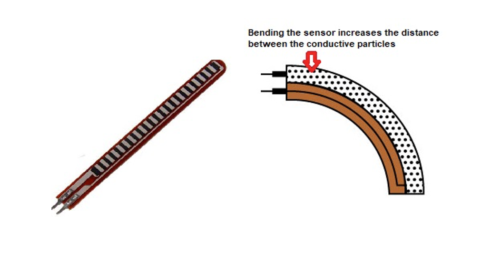
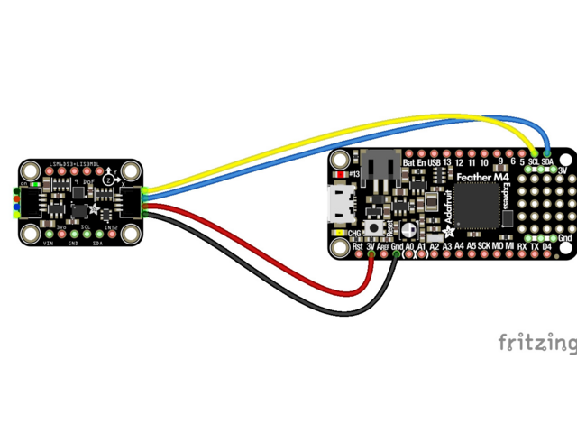
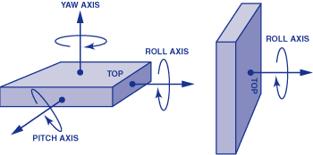
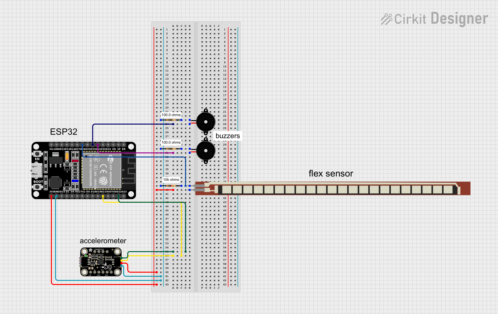
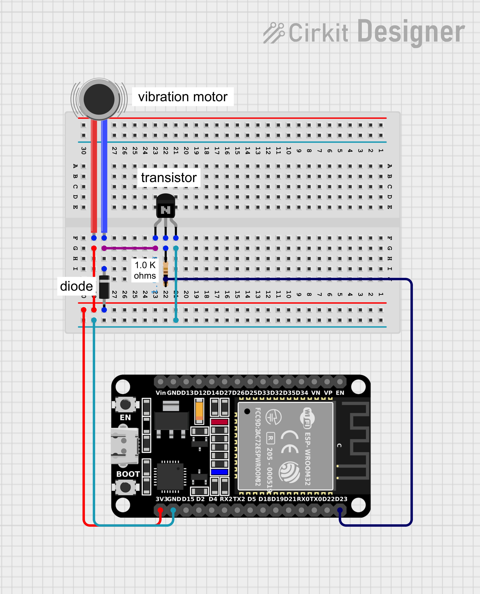
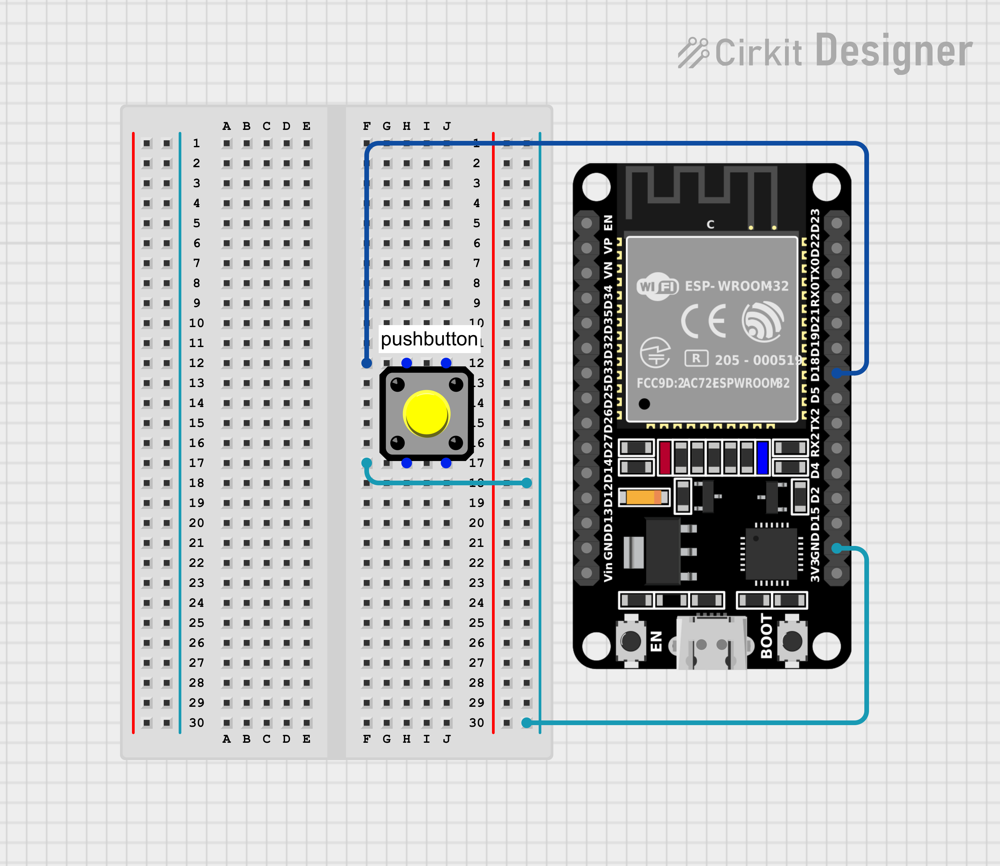

# Knee Rehabilitation Device
<!--
Replace this text with a brief description (2-3 sentences) of your project. This description should draw the reader in and make them interested in what you've built. You can include what the biggest challenges, takeaways, and triumphs from completing the project were. As you complete your portfolio, remember your audience is less familiar than you are with all that your project entails!
-->

| Pratiksha S | Lynbrook High School | Computer Science | Rising Junior |


# Modifications

## Overview
&nbsp;
&nbsp;
&nbsp;
&nbsp;
I added various code-based as well as physical modifications to my knee rehabilitation device. Here is a menu of what my modifications are and how they are activated:

Bluetooth Serial Input:
- ```'1'``` - A **Wall Sit Timer** is initiated.
- ```'2'``` - A **Squat Counter** is initiated.
Pushbutton Input:
- Button pressed for the ```1st``` time: **Vibration Mode** uses a vibration motor that vibrates near the knee joint whenever improper squat form is detected instead of using a buzzer.
- Button pressed for the ```2nd time```: **Massage Mode** is where the vibration motor continually vibrates to simulate a massage.
- Button pressed for the ```3rd time```: **LED Mode** uses an LED light strip that is green when the squat is done with proper form and red when the squat is done with improper form.
- Button pressed for the ```4th time```: **Party Mode** flashes a sequenece of rainbow lights.

### Wall Sit Timer
&nbsp;
&nbsp;
&nbsp;
&nbsp;
The wall sit timer tracks how long the user holds a wall sit position using the flex sensor. A wall sit is when the user leans against a wall in a seated position with their knees bent at 90°. When the wall sit position is reached, the wall sit timer starts.

&nbsp;
&nbsp;
&nbsp;
&nbsp;
First, the flex sensor values are read to determine when the user reaches a 90° position. If the flex sensor's value drops below the threshold I defined and the wall sit hasn't started yet, the code sets ```wallSitActive``` to ```true``` , records the start time in milliseconds (using the ```millis()``` function), and sends a message to the Bluetooth Serial Monitor that the wall sit has started.

&nbsp;
&nbsp;
&nbsp;
&nbsp;
As the user holds the wall sit position, the timer counts how many seconds they have held it for and prints it out onto the serial monitor.

&nbsp;
&nbsp;
&nbsp;
&nbsp;
If the user stands up, breaking away from the wall sit position, and the wall sit was active, the code calcualtes how much time has passed by calling the ```millis()``` function, resets the mode so it is ready for the next command, and prints out a summary of how many seconds the user did a wall sit for.

### Squat Counter
&nbsp;
&nbsp;
&nbsp;
&nbsp;
The squat counter tracks how many squats the user completes. It counts a complete squat when the user does a squat and returns to a normal standing position. The user then can choose to end the squat session, and the serial prints out a summary of how many squats they have completed. 

Since I figured out how to do the wall sit timer, the squat counter was fairly easy, especially since I didn't use the ```millis()``` function. First, I waited for the user to enter a squat position, so I waited until the flex sensor angle was around 90 degrees. Then, I waited for the user to stand up from the squat position. When the user stands up, 1 is added to the squat count. When the user chooses to end their session, they can type in ```'e'``` to get their workout summary.

### Mode 1 - Vibration Mode
&nbsp;
&nbsp;
&nbsp;
&nbsp;
In case a user does not want to listen to a buzzer for form feedback, I added a vibration motor so that they could rely on the feel of the vibration motor and the serial output to determine what they are doing incorrectly. The code writes ```digitalWrite(motorPin, HIGH)```, which turns the motor on, when bad form from either the flex sensor or the accelerometer is detected. The code writes ```digitalWrite(motorPin, LOW)``` when the user's form is good or they are not doing a squat.

&nbsp;
&nbsp;
&nbsp;
&nbsp;
Initially, for the vibration motor schematic, I was going to use a transistor, a resistor, and a diode, so I used another smaller PCB board and connected it to a bigger PCB where my main project was. But, I realized that I had complicated the cicuit for no reason. The vibration motor worked perfectly fine when connnected to simply just power and ground, so I ended up cutting off the wires that connected to the extended PCB board (after a failed attempt to desolder it).

### Mode 2 - Massage Mode
&nbsp;
&nbsp;
&nbsp;
&nbsp;
I wanted to add a therapeutic side to my knee rehab device, so I decided to use a coin vibration motor, since massage devices and equipment use coin vibration motors to deliver soothing vibrations to relax muscles, reduce tension, and increase blood flow. The code to add this was simple: I just set the ```motorPin``` to ```HIGH``` when this mode was activated.

### Mode 3 - LED Mode
&nbsp;
&nbsp;
&nbsp;
&nbsp;
Another modification I added was using an LED strip to alert the user of their squat form. Instead of a buzzer buzzing or a vibration motor vibrating whenever improper form is detected. When improper form is detected, the LED strip turns red. This is written as...
```c++
  for (int i = 0; i < NUMPIXELS; i++) {
    pixels.setPixelColor(i, pixels.Color(255, 0, 0));
    pixels.show();
  }
```

&nbsp;
&nbsp;
&nbsp;
&nbsp;
The ```.Color(R, G, B)``` method takes inputs of intesnsity levels between 0 and 255 of red, green, and blue respectively, hence why to show the color red, I used ```.Color(255, 0, 0)```. This is placed in a ```for loop``` so that every pixel on the strip shows this color.

&nbsp;
&nbsp;
&nbsp;
&nbsp;
When the user is standing or is not doing an improper squat, the default color of the strip is green. So, I did ```.Color(0, 255, 0)``` to show green.

#### Mode 4 - Party Mode

&nbsp;
&nbsp;
&nbsp;
&nbsp;
Calibrating the LED strip was my favorite part of my whole project. I wanted ot play around with it more and experiment with how I could show different light patterns, so I decided to use code that shows a rainbow light sequence. I used the following code:
```c++
  for (long firstPixelHue = 0; firstPixelHue < 5 * 65536; firstPixelHue += 256) {
    pixels.rainbow(firstPixelHue);
    pixels.show();  // Update strip with new contents
    delay(wait);
  }
```

&nbsp;
&nbsp;
&nbsp;
&nbsp;
This for loop makes sure that the first pixel's hue value has completed less than ```5``` full rotations around the color wheel. The value ```65536``` represents the range of values used to represent hues in a 16-bit system.

# Final Milestone
<!--
**Don't forget to replace the text below with the embedding for your milestone video. Go to Youtube, click Share -> Embed, and copy and paste the code to replace what's below.**

<iframe width="560" height="315" src="https://www.youtube.com/embed/F7M7imOVGug" title="YouTube video player" frameborder="0" allow="accelerometer; autoplay; clipboard-write; encrypted-media; gyroscope; picture-in-picture; web-share" allowfullscreen></iframe>

For your final milestone, explain the outcome of your project. Key details to include are:
- What you've accomplished since your previous milestone
- What your biggest challenges and triumphs were at BSE
- A summary of key topics you learned about
- What you hope to learn in the future after everything you've learned at BSE

-->
## Description
&nbsp;
&nbsp;
&nbsp;
&nbsp;
My final milestone overall was to sew all of my components onto my brace and test it to see if it accruately detects improper and proper squat form. 

&nbsp;
&nbsp;
&nbsp;
&nbsp;
In this milestone, I totally changed how my accelerometer values were being read. I scrapped the idea of using a logistic regression model, and instead, I used the Madgwick filter (see _Adafruit LSM6DS3 + LIS3MDL Accelerometer_) and used roll, pitch, and yaw values to get accurate data from my accelereometer. 

&nbsp;
&nbsp;
&nbsp;
&nbsp;
After I fixed this issue with my accelerometer, I worked on my modifications (see _Modifications_). I made some modifications solely through code and added other physical modifications. During this milestone, I began to research how to build the necessary circuits I needed for the physical modifications. This included a vibration motor, a pushbutton, and an LED light strip (see _Appendix B_).

&nbsp;
&nbsp;
&nbsp;
&nbsp;
Finally, I soldered my componenets to a PCB board, which took up most of my time, given that I am not the best at it. Then, I sewed my accelerometer and the PCB board to the brace, used velcro to attach the flex sensor onto the brace, and used electrical tape to bind some of the wires together so they look less crazy.

## Challenges
&nbsp;
&nbsp;
&nbsp;
&nbsp;
This milestone was suppose to be one of the less time-consuming milestones, yet I faced many challenges that stemmed my progress.

&nbsp;
&nbsp;
&nbsp;
&nbsp;
One problem I had was that after I had plugged in my device to power and uploaded the code, I noticed that the accelerometer was printing innacurate values because it was printing extremely slowly. The mistake I made was that I added too many delays. In my previous milestone, I added multiple delays around my code because I wanted to be able to read the data on my bluetooth serial easily, but this was diminishing the effectiveness of the improper squat form detection by the accelerometer. So, I removed pretty much every single delay in my code. This was because in my final project, seeing the raw accelroatin and flex sensor data is unecessary--only the feedback of good or bad form is important.

&nbsp;
&nbsp;
&nbsp;
&nbsp;
The problem that affected me the most was my soldering quality. After I did my first round of soldering, I realized that my connections were really loose, meaning that I didn't add enough solder to the joints. I frequently had to resolder some joints. And to make sure I wasn't accdientally creating shorts, I used a multimeter and connected its probes to rails that weren't supposed to be connected to each other. If the multimeter beeped, that meant that the rails were connected.

&nbsp;
&nbsp;
&nbsp;
&nbsp;
Another mistake I made was soldering wires with header pins that weren't tight enough to stay attached to the header pins of the ESP32. So, I carefully chose wires with tight header pins so I could replace the loose header pins with my them. I stripped the new wire and the wire that I already soldered onto my PCB board, soldered them both together, and added a heat shrink tube.

&nbsp;
&nbsp;
&nbsp;
&nbsp;
Another problem I encountered was that one of my buzzers stopped working. I could tell that it was turned on because I could hear a very faint clicking sound, but it wasn't buzzing like it was supposed to. Using a multimeter, I checked the connections and found out that the buzzer pin was not connected to the wire that handles the button input. I took a closer look at my broken buzzer and saw that it was not placed completely flat onto my PCB board. So, I tried to desolder the buzzer pins so I could push them more into the PCB board and resolder them. But, no matter how many times I tried to desolder it, I was unable to. As a result, I ended up adding a third buzzer and soldered a wire from the same rail of the previous buzzer's input wire to the rail connecting to the positve leg of the new buzzer. However, this did not work--this meant that my buzzers were working completely fine. I tried wiggling the wires a little bit a heard a proper buzzing sound. I realized that the problem was not because of the buzzer itself, but it was becaues of a problem with the input wire I chose. So, I stripped the wire and soldered a working wire to it.

## Next Steps
&nbsp;
&nbsp;
&nbsp;
&nbsp;
My next steps are to finalize and add my modfications to my project and make sure my device has sufficient functionality.

# Second Milestone
<!--
**Don't forget to replace the text below with the embedding for your milestone video. Go to Youtube, click Share -> Embed, and copy and paste the code to replace what's below.**

<iframe width="560" height="315" src="https://www.youtube.com/embed/y3VAmNlER5Y" title="YouTube video player" frameborder="0" allow="accelerometer; autoplay; clipboard-write; encrypted-media; gyroscope; picture-in-picture; web-share" allowfullscreen></iframe>

For your second milestone, explain what you've worked on since your previous milestone. You can highlight:
- Technical details of what you've accomplished and how they contribute to the final goal
- What has been surprising about the project so far
- Previous challenges you faced that you overcame
- What needs to be completed before your final milestone 
-->
<iframe width="560" height="315" src="https://www.youtube.com/embed/-PiUTkNgQGM?si=0JDh3qX_HEXwD2pu" title="YouTube video player" frameborder="0" allow="accelerometer; autoplay; clipboard-write; encrypted-media; gyroscope; picture-in-picture; web-share" referrerpolicy="strict-origin-when-cross-origin" allowfullscreen></iframe>

## Description
&nbsp;
&nbsp;
&nbsp;
&nbsp;
My second milestone overall was to create a working prototype of the knee rehab device. 

&nbsp;
&nbsp;
&nbsp;
&nbsp;
The first thing I did in this milestone was configure my Bluetooth Serial. I added in the ```<BleSerial.h>``` library, a variable called ```ble``` of type ```BleSerial```, and changed all of the original ```Serial.print```/```Serial.println``` commands to ```ble.print```/```ble.println```. This way, the BLESerialnRF52 app on my phone will print out all of the data that was originally printed onto my laptop onto my phone, making accessing data more accessible. In addition, since I connected my ESP32 to the Bluetooth, I was able to connect and power my prototype with an external power source--more specifically, a power bank--and not have to connect my prototype to a computer all the time. This made it easier to test my device because my wires weren't as strained when I connected it to my computer.

&nbsp;
&nbsp;
&nbsp;
&nbsp;
Later in this milestone, I learned how to give the Bluetooth serial commands so it would print specific data and stop doing certain actions. 
For example, when this character is typed into the Bluetooth serial...
- ```p```: Both the flex sensor and accelerometer readings are displayed/
- ```a```: Only the flex sensor values are displayed.
- ```f```: Only the accelerometer values are displayed.
- ```s```: Data is stopped being displayed, and any buzzers that were buzzing previously are stopped.
This way, it was much easier to read the values and verify that each component is working individually. I am planning to add more commands like these to activate my future modifications.
I also made the Bluetooth serial print out ```"Accelerometer: Bad form detected!"``` and ```"Flex sensor: Bad form detected!"``` at appropriate times.

&nbsp;
&nbsp;
&nbsp;
&nbsp;
What I focused the most on during this milestone is figuring out accurate thresholds for my accelerometer to be able to detect when my knee is bending inward while doing a squat. I tried various things to determine my thresholds, but the technique I stuck to in my final code was using a Logistic Regression Model from Google Colab. Logistic Regression is a machine learning method that finds the relationship between an independent variable and a dependent variable and creates a line of best fit to represent the data given to it. So, I did squats in proper form, where my knee wasn't bending inward, and did squats in improper form, where my knee was bending inward and observed how the X, Y, and Z axes were changing. On a Google Sheet, I recorded the three values on 10 different occasions I did a squat in improper form and 10 other occasions where I did a squat in proper form. I also created a 4th column to label the rows as either 'good' or 'bad.' Then, I downloaded the data as a ```.csv``` file and uploaded it to the Google Colab code to give the machine learning model simple and readable data. I also included the line ```df['label'] = df['label'].map({'good': 1, 'bad': 0})``` so the model reads 'good' as 1 and 'bad' as 0. When I ran the code, the output gave me the coefficients and the intercept of the regression equation ```y = a*x + b*y + c*z + d```. Then, I put this equation into my code to calculate a probability value using the logistic equation ```probability = 1.0 / (1.0 + exp(-linearSum));```. This formula converts the linear sum into a value that is between 0 and 1. If the value is greater than 0.5, then the model is more confident that the squat form is good. If the valueis less than 0.5, then the model is more confident that the squt form is bad. So, I used this 0.5 value as a threshold for determining when to buzz the buzzer associated with the accelerometer to alert of improper form.

&nbsp;
&nbsp;
&nbsp;
&nbsp;
Finally, I soldered my flex sensor pins to two wires so I could determine a threshold for it. Then, I used a rubber banded to secure it to the back of my brace to make sure my device worked.

## Challenges
&nbsp;
&nbsp;
&nbsp;
&nbsp;
At first, I noticed that the BLE Serial app on my phone was not displaying the values of the gyroscope correctly because it was cutting off half of the message, but later on, I realized that the messages were printing too fast. So, the problem was resolved after I added a few delays in between messages being printed.

&nbsp;
&nbsp;
&nbsp;
&nbsp;
My biggest problem during this milestone was making sure my accelerometer was accurate. At first, I was trying to use the X and Y axes of the gyroscope as the threshold for the bend of the knee because it measures angular velocity, which is the rate of rotation of an object around a particular axis. I thought this would be the best way to detect the inward bend of my knee, but I kept getting values that fluctuated between negative and positive decimals, making it difficult to define a clear, consistent threshold. 
Then, I tried using the X and Y axes of the accelerometer instead. As I observed the values while doing multiple squats, I noticed a general pattern that the values were decreasing over time as I continued doing reps. So, I figured I had to make a regression model to learn the pattern of my data and use it to classify good and bad squats.

## Next Steps
&nbsp;
&nbsp;
&nbsp;
&nbsp;
My next steps are to add more modfications to my project and sew everything together onto my brace.

# First Milestone
<!--
**Don't forget to replace the text below with the embedding for your milestone video. Go to Youtube, click Share -> Embed, and copy and paste the code to replace what's below.**

<iframe width="560" height="315" src="https://www.youtube.com/embed/CaCazFBhYKs" title="YouTube video player" frameborder="0" allow="accelerometer; autoplay; clipboard-write; encrypted-media; gyroscope; picture-in-picture; web-share" allowfullscreen></iframe>

For your first milestone, describe what your project is and how you plan to build it. You can include:
- An explanation about the different components of your project and how they will all integrate together
- Technical progress you've made so far
- Challenges you're facing and solving in your future milestones
- What your plan is to complete your project
-->
<iframe width="560" height="315" src="https://www.youtube.com/embed/7I427EQxpsU?si=inD3CkVD_oA9nTMT" title="YouTube video player" frameborder="0" allow="accelerometer; autoplay; clipboard-write; encrypted-media; gyroscope; picture-in-picture; web-share" referrerpolicy="strict-origin-when-cross-origin" allowfullscreen></iframe>

## Description
&nbsp; 
&nbsp;
&nbsp;
&nbsp;
My first milestone was to learn how to calibrate a flex sensor, an accelerometer, and buzzers with an ESP32. When the flex sensor's flexADC value is below a certain number (approximately what looks like 90 degrees to the naked eye), one buzzer will buzz continuously and the serial monitor prints out "Flex Sensor: Bad form detected!" I also tried sampling the data the flex sensor was outputing in attempt to make the data more accurate. I did this by reading ten values from the flex sensor at intervals of 0.01 seconds, finding the average of them, and print out that average. For the accelerometer, I used the example code provided by Arduino IDE (found when you go to 'File' and then press 'Examples') and added the logic to play the buzzer at a specific time. When the adafruit accelerometer's X-axis acceleration value is below a certain number, another buzzer, different from the one used for the flex sensor, will buzz in a different pattern, and the serial monitor prints out "Accelerometer: Bad form detected!" I also learned how to print out the outputs that were originally displayed on the Serial Monitor on my laptop onto an app on my phone called BLESerialnRF52.
## Challenges
&nbsp;
&nbsp;
&nbsp;
&nbsp;
Calibrating the accelerometer was one of the biggest challenges for me. One thing I did not pay attention to that set me back a little was that I downloaded the libraries and used the example code for the wrong accelerometer. The example code for the Adafruit LSM6DS3+LIS3MDL Accelerometer did not work as it was, so I had to tweak it a bit by uncommenting and changing line and downloading the necessary libraries. I also figured out that a 9600 baud rate wasn't suitable for the accelerometer and would either print out random symbols onto the serial monitor or nothing at all, so I changed all my code to begin the serial with a 112500 baud rate. The baud rate refers to the speed of data transmission, so a higher baud rate would be needed for the accelerometer because it generates data at high frequencies.
## Next Steps
&nbsp;
&nbsp;
&nbsp;
&nbsp;
The thresholds that I have currently initialized for the flex sensor and the accelerometer are estimates I defined based on the naked eye, so my next steps would be to make these thresholds more accurate by temporarily taping all of my components to a knee brace, creating a prototype.

# Starter Project Milestone

<iframe width="560" height="315" src="https://www.youtube.com/embed/OkP_cfM5t3o?si=ZXIxwUmzVvw81dvx" title="YouTube video player" frameborder="0" allow="accelerometer; autoplay; clipboard-write; encrypted-media; gyroscope; picture-in-picture; web-share" referrerpolicy="strict-origin-when-cross-origin" allowfullscreen></iframe>

## Description
&nbsp;
&nbsp;
&nbsp;
&nbsp;
My starter project was the Jitterbug. It used a lithium battery to power the device, a vibration motor that turns on using a switch system, two red LED lights, and metal wire for the legs of the Jitterbug. These pieces were mounted and soldered together on a circuit board. When the switch is turned on, the current within the board is able to flow from the battery, powering the LED lights and the vibration motor. The Jitterbug then moves in a circular motion on smooth surfaces.
## Challenges
&nbsp;
&nbsp;
&nbsp;
&nbsp;
I faced numerous challenges while working on this project. I had a lot of trouble soldering the pieces together properly. When I was soldering the wires of the vibration motor, I accidentally created a short between them. I figured this out after using a multimeter by measuring the resistance between the two joints. So, I learned how to desolder the short using the desoldering pump. Eventually, I figured out that my soldering iron wasn't working well, so I switched to a new one, which made soldering much more easy and neat. As someone who has no experience in working with hardware, I found this project a little confusing at first, but I ended up learning a lot by the time I was finished. 
## Next Steps
&nbsp;
&nbsp;
&nbsp;
&nbsp;
This project allowed me to gain significant experience in soldering and wiring logic. I will be needing these skills for my next step--my intensive project, the knee rehabilitation device.

# Flex Sensor
<!--
Here's where you'll put images of your schematics. [Tinkercad](https://www.tinkercad.com/blog/official-guide-to-tinkercad-circuits) and [Fritzing](https://fritzing.org/learning/) are both great resoruces to create professional schematic diagrams, though BSE recommends Tinkercad becuase it can be done easily and for free in the browser. 
-->
&nbsp;
&nbsp;
&nbsp;
&nbsp;
In my project, I needed a way to measure much my knee bends while doing a squat. A flex sensor is perfect for this task. 

&nbsp;
&nbsp;
&nbsp;
&nbsp;
A flex sensor is a type of variable resistor that changes its electrical resistance based on how much it is bent. When the sensor is straight, it has a lower resistance, and as it bends, the resistance increases. 

<div align="center">
  
</div>

&nbsp;
&nbsp;
&nbsp;
&nbsp;
This change in resistance can be measured and read by a microcontroller--in my case, an ESP32-WROOM--using a voltage divider circuit _(see Apendix B)_. I connected the flex sensor to the analog pin, pin number 26 on the ESP32. I chose GPIO 26 because it supports analog input, which is essential for this flex to be able to read the changing resistance values of the flex sensor.

&nbsp;
&nbsp;
&nbsp;
&nbsp;
In the code, I read the sensor values using the analogRead() function on pin 26:

&nbsp;
&nbsp;
&nbsp;
&nbsp;
```int flexADC = analogRead(flexPin);  // flexPin = 26```

&nbsp;
&nbsp;
&nbsp;
&nbsp;
The analog values read from the sensor are stored in the variable ```flexADC```. They range from 0 to 4095 on the ESP32 because it operates with a 12-bit resolution. These 4096 values are used to represent the voltage at the analog input pin. So, by default, 0 volts is converted to the digital value 0 and 3.3 volts is converted to the digital value of 4095.

&nbsp;
&nbsp;
&nbsp;
&nbsp;
In my knee rehab device, I placed the flex sensor behind the knee because measuring the inner bend of the knee would provide more accurate values. As I perform a squat, the sensor bends along with my knee, and the ESP32 reads the corresponding flexADC values in real time. This way, I was able to determine specific flexADC thresholds to track how deep the squat is.

# Adafruit LSM6DS3 + LIS3MDL Accelerometer
&nbsp;
&nbsp;
&nbsp;
&nbsp;
To detect improper knee form--like the knee bending inwards during a squat, I used the Adafruit LSM6DS3 + LIS3MDL, which has a 3-axis accelerometer, a 3-axis gyroscope, and a magnetometer. These allow the device to sense movement and orientation in real time.

&nbsp;
&nbsp;
&nbsp;
&nbsp;
I connected the sensor to the ESP32 over I2C. A frequent mistake I made was mixing up the I2C wires of the acceleormeter, which caused the accelerometer to fail with the error ```"I2C NACK connection failed"```.

<div align="center">
  
</div>

&nbsp;
&nbsp;
&nbsp;
&nbsp;
Here is the correct wiring:
- 🔴 Red wire: 3V (ESP32) --> VIN (sensor)
- ⚫ Black wire: GND (ESP32) --> GND (sensor)
- 🔵 Blue wire: GPIO 21 (ESP32 SDA) --> SDA (sensor)
- 🟡 Yellow wire: GPIO 22 (ESP32 SCL) --> SCL (sensor)

&nbsp;
&nbsp;
&nbsp;
&nbsp;
I downloaded the appropriate Adafruit LSM6DS33 libraries to initialize and read raw accelerometer and gyroscope data. Then, I used rubber bands to fasten the accelerometer to the side of my knee joint and did proper and improper squats to observe how the accelerometer and gyroscope values changed. 

&nbsp;
&nbsp;
&nbsp;
&nbsp;
However, later on, I realized that these raw acceleration and gyroscope values aren't enough to get accurate data, so I used the Madgwick filter by downloading the ```MadgwickAHRS``` library. The Madgwick filter is a sensor fusion algorithm that is able to estimate the orientation of a sensor. The orientation in a 3D space is represented by the values roll, pitch, and yaw.

<div align="center">
  
</div>

- ```Roll```: rotation around longitidinal axis
- ```Pitch```: rotation around lateral axis
- ```Yaw```: rotation around vertical axis
  
&nbsp;
&nbsp;
&nbsp;
&nbsp;
The methods used to get these values are simple as well: ```.getRoll()```, ```.getPitch()```, and ```.getYaw()```.

&nbsp;
&nbsp;
&nbsp;
&nbsp;
I ran Arduino IDE's example code for this filter. Since my specific accelerometer already converts some of the sensor data internally, I had to adjust the formulas to get roll and pitch values in degrees. This filter significantly reduced the noise and inconsistency I had when using only the raw sensor values, improving the accuracy and reliability of detecting bad form.

# Logistic Regression Model

Code:
```cpp
import pandas as pd
import io
from sklearn.linear_model import LogisticRegression

df = pd.read_csv(io.BytesIO(uploaded['accel_data - Sheet1 (2).csv']))

df['label'] = df['label'].map({'good': 1, 'bad': 0})

X = df[['x', 'y', 'z']]  # Features
y = df['label']          # Output (0 or 0)

model = LogisticRegression()
model.fit(X, y)


print("Coefficients (weights):", model.coef_)
print("Intercept:", model.intercept_)
```

Output:
```cpp
Coefficients (weights): [[ 0.28821893  0.92750543 -1.60632781]]
Intercept: [0.49655361]
```


# Bill of Materials
<!--
Here's where you'll list the parts in your project. To add more rows, just copy and paste the example rows below.
Don't forget to place the link of where to buy each component inside the quotation marks in the corresponding row after href =. Follow the guide [here]([url](https://www.markdownguide.org/extended-syntax/)) to learn how to customize this to your project needs. 
-->

| **Part** | **Note** | **Price** | **Link** |
|:--:|:--:|:--:|:--:|
| ESP-WROOM-32 | What the item is used for | $Price | <a href="https://www.amazon.com/Arduino-A000066-ARDUINO-UNO-R3/dp/B008GRTSV6/"> Link </a> |
| Adafruit LSM6DS3+LIS3MDL Accelerometer | What the item is used for | $Price | <a href="https://www.amazon.com/Arduino-A000066-ARDUINO-UNO-R3/dp/B008GRTSV6/"> Link </a> |
| Flex Sensor (4.5”) | What the item is used for | $Price | <a href="https://www.amazon.com/Arduino-A000066-ARDUINO-UNO-R3/dp/B008GRTSV6/"> Link </a> |
| Knee Compression Sleeve | What the item is used for | $Price | <a href="https://www.amazon.com/Arduino-A000066-ARDUINO-UNO-R3/dp/B008GRTSV6/"> Link </a> |
| 5000 mAh Power Bank (10 cm x 3 cm) | What the item is used for | $Price | <a href="https://www.amazon.com/Arduino-A000066-ARDUINO-UNO-R3/dp/B008GRTSV6/"> Link </a> |
| Neoprene fabric (2” x 6”) | What the item is used for | $Price | <a href="https://www.amazon.com/Arduino-A000066-ARDUINO-UNO-R3/dp/B008GRTSV6/"> Link </a> |
| Sewing Kit | What the item is used for | $Price | <a href="https://www.amazon.com/Arduino-A000066-ARDUINO-UNO-R3/dp/B008GRTSV6/"> Link </a> |
| Jumper Wires | What the item is used for | $Price | <a href="https://www.amazon.com/Arduino-A000066-ARDUINO-UNO-R3/dp/B008GRTSV6/"> Link </a> |
| USB cable for ESP32 | What the item is used for | $Price | <a href="https://www.amazon.com/Arduino-A000066-ARDUINO-UNO-R3/dp/B008GRTSV6/"> Link </a> |
| PCB Board | What the item is used for | $Price | <a href="https://www.amazon.com/Arduino-A000066-ARDUINO-UNO-R3/dp/B008GRTSV6/"> Link </a> |
| Piezo Buzzer | What the item is used for | $Price | <a href="https://www.amazon.com/Arduino-A000066-ARDUINO-UNO-R3/dp/B008GRTSV6/"> Link </a> |
| 10k Ohm Resistor | What the item is used for | $Price | <a href="https://www.amazon.com/Arduino-A000066-ARDUINO-UNO-R3/dp/B008GRTSV6/"> Link </a> |
| 100 Ohm Resistor | What the item is used for | $Price | <a href="https://www.amazon.com/Arduino-A000066-ARDUINO-UNO-R3/dp/B008GRTSV6/"> Link </a> |
| EMA (Exponential Moving Average) Filters | What the item is used for | $Price | <a href="https://blog.mbedded.ninja/programming/signal-processing/digital-filters/exponential-moving-average-ema-filter/"> Link </a> |

# Other Resources/Examples
<!--
One of the best parts about Github is that you can view how other people set up their own work. Here are some past BSE portfolios that are awesome examples. You can view how they set up their portfolio, and you can view their index.md files to understand how they implemented different portfolio components.
- [Example 1](https://trashytuber.github.io/YimingJiaBlueStamp/)
- [Example 2](https://sviatil0.github.io/Sviatoslav_BSE/)
- [Example 3](https://arneshkumar.github.io/arneshbluestamp/)

To watch the BSE tutorial on how to create a portfolio, click here.
-->
- [Flex Sensor Hookup Guide](https://learn.sparkfun.com/tutorials/flex-sensor-hookup-guide/all)
- [Adafruit LSM6DS3TR-C LIS3MD Overview](https://learn.adafruit.com/adafruit-lsm6ds3tr-c-lis3mdl-precision-9-dof-imu/overview)
- [Arduino LSM6DS3 Example Code](https://docs.arduino.cc/libraries/arduino_lsm6ds3/)
- [Logistic Regression Model](https://colab.research.google.com/github/diannekrouse/LRPython/blob/master/LogisticRegression.ipynb)
- [Vibration Motor Hookup](https://www.circuito.io/app?components=513,8449,360217)
- [Button Tutorial](https://www.youtube.com/watch?v=IRAXPR1i2Mg&t=12s)
- [LED Light Strip w/ ESP32](https://randomnerdtutorials.com/esp32-esp8266-rgb-led-strip-web-server/)

# Appendix A
## Milestone 1
### Flex Sensor
```c++

const int flexPin = 26;
const int flexBuzzer = 33;
const int num = 10; // sampling every 10 data points

void setup() {
  Serial.begin(9600);
  pinMode(flexPin, INPUT);
  pinMode(flexBuzzer, OUTPUT);
}

void loop() {
  int sum = 0;
  for (int i = 0; i < num; i++) {
    sum += analogRead(flexPin);
    delay(10);
  }

  int flexADC = sum/num; // find average of values to determine more accurate data points

  if (flexADC < 620) { // threshold will be made more accurate in next milestone
    tone(flexBuzzer, 1000); // buzzer plays
  } else {
    noTone(flexBuzzer);
  }

  Serial.println(flexADC); // print values of flex sensor

  delay(500);
}
```

### Accelerometer
```c++
#include <Adafruit_BusIO_Register.h>
#include <Adafruit_GenericDevice.h>
#include <Adafruit_I2CDevice.h>
#include <Adafruit_I2CRegister.h>
#include <Adafruit_SPIDevice.h>

#include <Adafruit_LIS3MDL.h>

#include <Adafruit_ISM330DHCX.h>
#include <Adafruit_LSM6DS.h>
#include <Adafruit_LSM6DS3.h>
#include <Adafruit_LSM6DS33.h>
#include <Adafruit_LSM6DS3TRC.h>
#include <Adafruit_LSM6DSL.h>
#include <Adafruit_LSM6DSO32.h>
#include <Adafruit_LSM6DSOX.h>

#include <Adafruit_Sensor.h>

#include <BleSerial.h>

// Basic demo for accelerometer/gyro readings from Adafruit LSM6DS33

// For SPI mode, we need a CS pin
#define LSM_CS 10
// For software-SPI mode we need SCK/MOSI/MISO pins
#define LSM_SCK 13
#define LSM_MISO 12
#define LSM_MOSI 11

Adafruit_LSM6DS33 lsm6ds33;

const int accelBuzzer = 32;
const int flexPin = 26;
const int flexBuzzer = 33;
const int num = 10; // for samplng data
const int flexADCThreshold = 620;

void setup(void) {
  Serial.begin(115200);
  pinMode(accelBuzzer, OUTPUT);
  pinMode(flexPin, INPUT);
  pinMode(flexBuzzer, OUTPUT);
  

  while (!Serial)
    delay(10); // will pause Zero, Leonardo, etc until serial console opens

  Serial.println("Adafruit LSM6DS33 test!");

  // find accelerometer chips
  if (lsm6ds33.begin_I2C()) {
    Serial.println("Finding LSM6DS33 chip");
    while (1) {
      delay(10);
    }
  }

  Serial.println("LSM6DS33 Found!");

  // set range of accelerometer
  lsm6ds33.setAccelRange(LSM6DS_ACCEL_RANGE_2_G);
  Serial.print("Accelerometer range set to: ");
  switch (lsm6ds33.getAccelRange()) {
  case LSM6DS_ACCEL_RANGE_2_G:
    Serial.println("+-2G");
    break;
  case LSM6DS_ACCEL_RANGE_4_G:
    Serial.println("+-4G");
    break;
  case LSM6DS_ACCEL_RANGE_8_G:
    Serial.println("+-8G");
    break;
  case LSM6DS_ACCEL_RANGE_16_G:
    Serial.println("+-16G");
    break;
  }

  // set range of gyroscope
  lsm6ds33.setGyroRange(LSM6DS_GYRO_RANGE_250_DPS);
  Serial.print("Gyro range set to: ");
  switch (lsm6ds33.getGyroRange()) {
  case LSM6DS_GYRO_RANGE_125_DPS:
    Serial.println("125 degrees/s");
    break;
  case LSM6DS_GYRO_RANGE_250_DPS:
    Serial.println("250 degrees/s");
    break;
  case LSM6DS_GYRO_RANGE_500_DPS:
    Serial.println("500 degrees/s");
    break;
  case LSM6DS_GYRO_RANGE_1000_DPS:
    Serial.println("1000 degrees/s");
    break;
  case LSM6DS_GYRO_RANGE_2000_DPS:
    Serial.println("2000 degrees/s");
    break;
  case ISM330DHCX_GYRO_RANGE_4000_DPS:
    break; // unsupported range for the DS33
  }

  // set accelerometer data rate
  lsm6ds33.setAccelDataRate(LSM6DS_RATE_12_5_HZ);
  Serial.print("Accelerometer data rate set to: ");
  switch (lsm6ds33.getAccelDataRate()) {
  case LSM6DS_RATE_SHUTDOWN:
    Serial.println("0 Hz");
    break;
  case LSM6DS_RATE_12_5_HZ:
    Serial.println("12.5 Hz");
    break;
  case LSM6DS_RATE_26_HZ:
    Serial.println("26 Hz");
    break;
  case LSM6DS_RATE_52_HZ:
    Serial.println("52 Hz");
    break;
  case LSM6DS_RATE_104_HZ:
    Serial.println("104 Hz");
    break;
  case LSM6DS_RATE_208_HZ:
    Serial.println("208 Hz");
    break;
  case LSM6DS_RATE_416_HZ:
    Serial.println("416 Hz");
    break;
  case LSM6DS_RATE_833_HZ:
    Serial.println("833 Hz");
    break;
  case LSM6DS_RATE_1_66K_HZ:
    Serial.println("1.66 KHz");
    break;
  case LSM6DS_RATE_3_33K_HZ:
    Serial.println("3.33 KHz");
    break;
  case LSM6DS_RATE_6_66K_HZ:
    Serial.println("6.66 KHz");
    break;
  }

  // set gyroscope data rate
  lsm6ds33.setGyroDataRate(LSM6DS_RATE_12_5_HZ);
  Serial.print("Gyro data rate set to: ");
  switch (lsm6ds33.getGyroDataRate()) {
  case LSM6DS_RATE_SHUTDOWN:
    Serial.println("0 Hz");
    break;
  case LSM6DS_RATE_12_5_HZ:
    Serial.println("12.5 Hz");
    break;
  case LSM6DS_RATE_26_HZ:
    Serial.println("26 Hz");
    break;
  case LSM6DS_RATE_52_HZ:
    Serial.println("52 Hz");
    break;
  case LSM6DS_RATE_104_HZ:
    Serial.println("104 Hz");
    break;
  case LSM6DS_RATE_208_HZ:
    Serial.println("208 Hz");
    break;
  case LSM6DS_RATE_416_HZ:
    Serial.println("416 Hz");
    break;
  case LSM6DS_RATE_833_HZ:
    Serial.println("833 Hz");
    break;
  case LSM6DS_RATE_1_66K_HZ:
    Serial.println("1.66 KHz");
    break;
  case LSM6DS_RATE_3_33K_HZ:
    Serial.println("3.33 KHz");
    break;
  case LSM6DS_RATE_6_66K_HZ:
    Serial.println("6.66 KHz");
    break;
  }

  lsm6ds33.configInt1(false, false, true); // accelerometer DRDY on INT1
  lsm6ds33.configInt2(false, true, false); // gyro DRDY on INT2
}

void loop() {

  // Declare sensor event objects to store data from accelerometer, gyroscope, and magnetometer
  sensors_event_t accel; // accelerometer readings (x, y, z)
  sensors_event_t gyro; // gyroscope readings (x, y, z)
  sensors_event_t temp; // temperature reading
  lsm6ds33.getEvent(&accel, &gyro, &temp); // read sensor data in real time

  Serial.print("\t\tTemperature ");
  Serial.print(temp.temperature);
  Serial.println(" deg C");

  /* Display the results (acceleration is measured in m/s^2) */
  Serial.print("\t\tAccel X: ");
  Serial.print(accel.acceleration.x);
  Serial.print(" \tY: ");
  Serial.print(accel.acceleration.y);
  Serial.print(" \tZ: ");
  Serial.print(accel.acceleration.z);
  Serial.println(" m/s^2 ");

  /* Display the results (rotation is measured in rad/s) */
  Serial.print("\t\tGyro X: ");
  Serial.print(gyro.gyro.x);
  Serial.print(" \tY: ");
  Serial.print(gyro.gyro.y);
  Serial.print(" \tZ: ");
  Serial.print(gyro.gyro.z);
  Serial.println(" radians/s ");

  delay(100);


  float accelXThreshold = -0.40; // estimated threshold

  bool badForm = false;

  if (accel.acceleration.x < accelXThreshold) {
    badForm = true;
  }

  if (badForm == true) {
    // buzzer pattern for accelerometer
    tone(accelBuzzer, 1000);
    Serial.println("\t\tAccelerometer: Bad form detected!");
    Serial.println();
    delay(250);   
    noTone(accelBuzzer);
    delay(100);
    tone(accelBuzzer, 1000);
    delay(250);          
    noTone(accelBuzzer);
    delay(500);
  } else {
    noTone(accelBuzzer);
  }

  delay(500);
}
```

## Milestone 2
```cpp
// Basic demo for accelerometer/gyro readings from Adafruit LSM6DS33

// For SPI mode, we need a CS pin
#define LSM_CS 10
// For software-SPI mode we need SCK/MOSI/MISO pins
#define LSM_SCK 13
#define LSM_MISO 12
#define LSM_MOSI 11

Adafruit_LSM6DS33 lsm6ds33;
BleSerial ble; // variable needed to communicate with BLE serial modules

const int accelBuzzer = 32;
const int flexPin = 26;
const int flexBuzzer = 33;
const int num = 10; // for averaging data
const int flexADCThreshold = 710;

bool badFormFlex = false;
bool badFormAccel = false;

bool printEnabled = false;
bool printFlex = false;
bool printAccel = false;

void setup(void) {
  Serial.begin(115200);
  pinMode(accelBuzzer, OUTPUT);
  pinMode(flexPin, INPUT);
  pinMode(flexBuzzer, OUTPUT);
  ble.begin("Pratiksha'sBleSerialTest");

  while (!Serial)
    delay(10);

  ble.println("Adafruit LSM6DS33 test!");

  if (lsm6ds33.begin_I2C()) {
    ble.println("Finding LSM6DS33 chip");
    while (1) {
      delay(10);
    }
  }

  ble.println("LSM6DS33 Found!");

  lsm6ds33.setAccelRange(LSM6DS_ACCEL_RANGE_2_G);
  ble.print("Accelerometer range set to: ");
  switch (lsm6ds33.getAccelRange()) {
  case LSM6DS_ACCEL_RANGE_2_G:
    ble.println("+-2G");
    break;
  case LSM6DS_ACCEL_RANGE_4_G:
    ble.println("+-4G");
    break;
  case LSM6DS_ACCEL_RANGE_8_G:
    ble.println("+-8G");
    break;
  case LSM6DS_ACCEL_RANGE_16_G:
    ble.println("+-16G");
    break;
  }

  lsm6ds33.setGyroRange(LSM6DS_GYRO_RANGE_250_DPS);
  ble.print("Gyro range set to: ");
  switch (lsm6ds33.getGyroRange()) {
  case LSM6DS_GYRO_RANGE_125_DPS:
    ble.println("125 degrees/s");
    break;
  case LSM6DS_GYRO_RANGE_250_DPS:
    ble.println("250 degrees/s");
    break;
  case LSM6DS_GYRO_RANGE_500_DPS:
    ble.println("500 degrees/s");
    break;
  case LSM6DS_GYRO_RANGE_1000_DPS:
    ble.println("1000 degrees/s");
    break;
  case LSM6DS_GYRO_RANGE_2000_DPS:
    ble.println("2000 degrees/s");
    break;
  case ISM330DHCX_GYRO_RANGE_4000_DPS:
    break; 
  }

  lsm6ds33.setAccelDataRate(LSM6DS_RATE_12_5_HZ);
  ble.print("Accelerometer data rate set to: ");
  switch (lsm6ds33.getAccelDataRate()) {
  case LSM6DS_RATE_SHUTDOWN:
    ble.println("0 Hz");
    break;
  case LSM6DS_RATE_12_5_HZ:
    ble.println("12.5 Hz");
    break;
  case LSM6DS_RATE_26_HZ:
    ble.println("26 Hz");
    break;
  case LSM6DS_RATE_52_HZ:
    ble.println("52 Hz");
    break;
  case LSM6DS_RATE_104_HZ:
    ble.println("104 Hz");
    break;
  case LSM6DS_RATE_208_HZ:
    ble.println("208 Hz");
    break;
  case LSM6DS_RATE_416_HZ:
    ble.println("416 Hz");
    break;
  case LSM6DS_RATE_833_HZ:
    ble.println("833 Hz");
    break;
  case LSM6DS_RATE_1_66K_HZ:
    ble.println("1.66 KHz");
    break;
  case LSM6DS_RATE_3_33K_HZ:
    ble.println("3.33 KHz");
    break;
  case LSM6DS_RATE_6_66K_HZ:
    ble.println("6.66 KHz");
    break;
  }

  lsm6ds33.setGyroDataRate(LSM6DS_RATE_12_5_HZ);
  ble.print("Gyro data rate set to: ");
  switch (lsm6ds33.getGyroDataRate()) {
  case LSM6DS_RATE_SHUTDOWN:
    ble.println("0 Hz");
    break;
  case LSM6DS_RATE_12_5_HZ:
    ble.println("12.5 Hz");
    break;
  case LSM6DS_RATE_26_HZ:
    ble.println("26 Hz");
    break;
  case LSM6DS_RATE_52_HZ:
    ble.println("52 Hz");
    break;
  case LSM6DS_RATE_104_HZ:
    ble.println("104 Hz");
    break;
  case LSM6DS_RATE_208_HZ:
    ble.println("208 Hz");
    break;
  case LSM6DS_RATE_416_HZ:
    ble.println("416 Hz");
    break;
  case LSM6DS_RATE_833_HZ:
    ble.println("833 Hz");
    break;
  case LSM6DS_RATE_1_66K_HZ:
    ble.println("1.66 KHz");
    break;
  case LSM6DS_RATE_3_33K_HZ:
    ble.println("3.33 KHz");
    break;
  case LSM6DS_RATE_6_66K_HZ:
    ble.println("6.66 KHz");
    break;
  }

  lsm6ds33.configInt1(false, false, true);
  lsm6ds33.configInt2(false, true, false);

  ble.println("Knee Rehab Device initiated.");
}

void loop() {
  if (ble.available() > 0) {
    char incomingChar = ble.read(); // read user's input from input stream

    if (incomingChar == 'p') { // prints flex sensor and accelerometer values
      printFlex = true;
      printAccel = true;
      ble.println();
      ble.println("Printing data...");
      ble.println();
    } else if (incomingChar == 'f' ) { // prints flex sensor values
      printFlex = true;
      printAccel = false;
      ble.println();
      ble.println("Printing flex sensor readings...");
      ble.println();
    } else if (incomingChar == 'a') {  // prints accelerometer values
      printFlex = false;
      printAccel = true;
      ble.println();
      ble.println("Printing accelerometer readings...");
      ble.println();
    } else if (incomingChar == 's') {  // stops printing
      printFlex = false;
      printAccel = false;
      ble.println();
      ble.println("Printing disabled.");
      ble.println();
      noTone(accelBuzzer);
      noTone(flexBuzzer);
    }

  if (printFlex == true && printAccel == true) {

  sensors_event_t accel;
  sensors_event_t gyro;
  sensors_event_t temp;
  
  lsm6ds33.getEvent(&accel, &gyro, &temp);

  float linearSum = 0.28821893*accel.acceleration.x +  0.92750543*accel.acceleration.y -1.60632781*accel.acceleration.z + 0.49655361;  // coefficients from logistic regression model
  float probability = 1.0 / (1.0 + exp(-linearSum));  // logistic function equation

  ble.print("Temperature ");
  ble.print(temp.temperature);
  ble.println(" deg C");

  delay(50);

  /* Display the results (acceleration is measured in m/s^2) */
  ble.print("Accel X: ");
  ble.print(accel.acceleration.x);
  ble.print(" \tY: ");
  ble.print(accel.acceleration.y);
  ble.print(" \tZ: ");
  ble.print(accel.acceleration.z);
  ble.println(" m/s^2 ");

  delay(100);

  /* Display the results (rotation is measured in rad/s) */
  ble.print("Gyro X: ");
  ble.print(gyro.gyro.x);
  ble.print(" \tY: ");
  ble.print(gyro.gyro.y);
  ble.print(" \tZ: ");
  ble.print(gyro.gyro.z);
  ble.println(" radians/s ");
  ble.println();

  delay(100);

  if (probability < 0.5) { // less than 0.5 means squat is more likely to be in improper form
    badFormAccel = true;
    tone(accelBuzzer, 1000);
    ble.println();
    ble.println("\tAccelerometer: Bad form detected!");
    ble.println();
    delay(200);   
    noTone(accelBuzzer);
    delay(50);
    tone(accelBuzzer, 1000);
    delay(200);          
    noTone(accelBuzzer);
    delay(300);
  } else {
    noTone(accelBuzzer);
  }

  // average flexADC values for increased accuracy of readings
  int sum = 0;
  for (int i = 0; i < num; i++) {
    sum += analogRead(flexPin);
    delay(10);
  }
  
  int flexADC = sum/num;

  if (flexADC < flexADCThreshold) {
    badFormFlex = true;
    ble.println();
    ble.println("\tFlex Sensor: Bad form detected!");
    ble.println();
    tone(flexBuzzer, 1000);
  } else {
    noTone(flexBuzzer);
  }

  delay(100);

  ble.println();
  ble.print("FlexADC value: ");
  ble.println(flexADC);
  ble.println();

  delay(400);

} else if (printFlex == true && printAccel == false) {

  int sum = 0;
  for (int i = 0; i < num; i++) {
    sum += analogRead(flexPin);
    delay(10);
  }
  
  int flexADC = sum/num;

  if (flexADC < flexADCThreshold) {
    badFormFlex = true;
    ble.println();
    ble.println("\tFlex Sensor: Bad form detected!");
    ble.println();
    tone(flexBuzzer, 1000);
  } else {
    noTone(flexBuzzer);
  }

  delay(100);

  ble.println();
  ble.print("FlexADC value: ");
  ble.println(flexADC);
  ble.println();

  delay(400);

} else if (printFlex == false && printAccel == true) {

  sensors_event_t accel;
  sensors_event_t gyro;
  sensors_event_t temp;
  
  lsm6ds33.getEvent(&accel, &gyro, &temp);

  float linearSum = 0.28821893*accel.acceleration.x +  0.92750543*accel.acceleration.y -1.60632781*accel.acceleration.z + 0.49655361;
  float probability = 1.0 / (1.0 + exp(-linearSum)); 

  ble.print("Temperature ");
  ble.print(temp.temperature);
  ble.println(" deg C");

  delay(50);

  /* Display the results (acceleration is measured in m/s^2) */
  ble.print("Accel X: ");
  ble.print(accel.acceleration.x);
  ble.print(" \tY: ");
  ble.print(accel.acceleration.y);
  ble.print(" \tZ: ");
  ble.print(accel.acceleration.z);
  ble.println(" m/s^2 ");

  delay(100);

  /* Display the results (rotation is measured in rad/s) */
  ble.print("Gyro X: ");
  ble.print(gyro.gyro.x);
  ble.print(" \tY: ");
  ble.print(gyro.gyro.y);
  ble.print(" \tZ: ");
  ble.print(gyro.gyro.z);
  ble.println(" radians/s ");
  ble.println();

  delay(100);

  if (probability < 0.5) {
    badFormAccel = true;
    tone(accelBuzzer, 1000);
    ble.println();
    ble.println("\tAccelerometer: Bad form detected!");
    ble.println();
    delay(200);   
    noTone(accelBuzzer);
    delay(50);
    tone(accelBuzzer, 1000);
    delay(200);          
    noTone(accelBuzzer);
    delay(300);
  } else {
    noTone(accelBuzzer);
  }
    }
}
}
```

## Milestone 3
```c++
#include <BleSerial.h>

// all of the below libraries are necessary for the accelerometer
#include <Adafruit_BusIO_Register.h>
#include <Adafruit_GenericDevice.h>
#include <Adafruit_I2CDevice.h>
#include <Adafruit_I2CRegister.h>
#include <Adafruit_SPIDevice.h>

#include <Adafruit_LIS3MDL.h>

#include <Adafruit_ISM330DHCX.h>
#include <Adafruit_LSM6DS.h>
#include <Adafruit_LSM6DS3.h>
#include <Adafruit_LSM6DS33.h>
#include <Adafruit_LSM6DS3TRC.h>
#include <Adafruit_LSM6DSL.h>
#include <Adafruit_LSM6DSO32.h>
#include <Adafruit_LSM6DSOX.h>

#include <Adafruit_Sensor.h>

#include <MadgwickAHRS.h>
#include <math.h>

// For SPI mode, we need a CS pin
#define LSM_CS 10
// For software-SPI mode we need SCK/MOSI/MISO pins
#define LSM_SCK 13
#define LSM_MISO 12
#define LSM_MOSI 11

Adafruit_LSM6DS33 lsm6ds33;
BleSerial ble;
Madgwick filter;

float accelScale, gyroScale;

// Smoothed sensor values (EMA)
float ax_filtered = 0, ay_filtered = 0, az_filtered = 0;
float gx_filtered = 0, gy_filtered = 0, gz_filtered = 0;
float alpha = 0.2;  // EMA smoothing factor

float zeroRoll = 0, zeroPitch = 0, zeroYaw = 0; // Baseline (for calibration)

const int flexPin = 26;
const int accelBuzzer = 4;
const int flexBuzzer = 33;

const int flexADCThreshold = 270;
const int num = 10; // for averaging data
int sum = 0;
int flexADC = 0;

bool badFormFlex = false;
bool badFormAccel = false;

bool printEnabled = false;
bool printFlex = false;
bool printAccel = false;

void setup(void) {
  Serial.begin(115200);
  pinMode(flexPin, INPUT);
  pinMode(flexBuzzer, OUTPUT);
  pinMode(accelBuzzer, OUTPUT);
  ble.begin("Pratiksha'sBleSerialTest");

  while (!Serial)
    delay(10);

    ble.println("Adafruit LSM6DS33 test!");

  if (lsm6ds33.begin_I2C()) {
    ble.println("Finding LSM6DS33 chip");
    while (1) {
      delay(10);
    }
  }

  ble.println("LSM6DS33 Found!");

  filter.begin(20);

  lsm6ds33.setAccelRange(LSM6DS_ACCEL_RANGE_2_G);
  ble.print("Accelerometer range set to: ");
  switch (lsm6ds33.getAccelRange()) {
  case LSM6DS_ACCEL_RANGE_2_G:
    ble.println("+-2G");
    break;
  case LSM6DS_ACCEL_RANGE_4_G:
    ble.println("+-4G");
    break;
  case LSM6DS_ACCEL_RANGE_8_G:
    ble.println("+-8G");
    break;
  case LSM6DS_ACCEL_RANGE_16_G:
    ble.println("+-16G");
    break;
  }

  lsm6ds33.setGyroRange(LSM6DS_GYRO_RANGE_250_DPS);
  ble.print("Gyro range set to: ");
  switch (lsm6ds33.getGyroRange()) {
  case LSM6DS_GYRO_RANGE_125_DPS:
    ble.println("125 degrees/s");
    break;
  case LSM6DS_GYRO_RANGE_250_DPS:
    ble.println("250 degrees/s");
    break;
  case LSM6DS_GYRO_RANGE_500_DPS:
    ble.println("500 degrees/s");
    break;
  case LSM6DS_GYRO_RANGE_1000_DPS:
    ble.println("1000 degrees/s");
    break;
  case LSM6DS_GYRO_RANGE_2000_DPS:
    ble.println("2000 degrees/s");
    break;
  case ISM330DHCX_GYRO_RANGE_4000_DPS:
    break; 
  }

  lsm6ds33.setAccelDataRate(LSM6DS_RATE_52_HZ);
  ble.print("Accelerometer data rate set to: ");
  switch (lsm6ds33.getAccelDataRate()) {
  case LSM6DS_RATE_SHUTDOWN:
    ble.println("0 Hz");
    break;
  case LSM6DS_RATE_12_5_HZ:
    ble.println("12.5 Hz");
    break;
  case LSM6DS_RATE_26_HZ:
    ble.println("26 Hz");
    break;
  case LSM6DS_RATE_52_HZ:
    ble.println("52 Hz");
    break;
  case LSM6DS_RATE_104_HZ:
    ble.println("104 Hz");
    break;
  case LSM6DS_RATE_208_HZ:
    ble.println("208 Hz");
    break;
  case LSM6DS_RATE_416_HZ:
    ble.println("416 Hz");
    break;
  case LSM6DS_RATE_833_HZ:
    ble.println("833 Hz");
    break;
  case LSM6DS_RATE_1_66K_HZ:
    ble.println("1.66 KHz");
    break;
  case LSM6DS_RATE_3_33K_HZ:
    ble.println("3.33 KHz");
    break;
  case LSM6DS_RATE_6_66K_HZ:
    ble.println("6.66 KHz");
    break;
  }

  lsm6ds33.setGyroDataRate(LSM6DS_RATE_52_HZ);
  ble.print("Gyro data rate set to: ");
  switch (lsm6ds33.getGyroDataRate()) {
  case LSM6DS_RATE_SHUTDOWN:
    ble.println("0 Hz");
    break;
  case LSM6DS_RATE_12_5_HZ:
    ble.println("12.5 Hz");
    break;
  case LSM6DS_RATE_26_HZ:
    ble.println("26 Hz");
    break;
  case LSM6DS_RATE_52_HZ:
    ble.println("52 Hz");
    break;
  case LSM6DS_RATE_104_HZ:
    ble.println("104 Hz");
    break;
  case LSM6DS_RATE_208_HZ:
    ble.println("208 Hz");
    break;
  case LSM6DS_RATE_416_HZ:
    ble.println("416 Hz");
    break;
  case LSM6DS_RATE_833_HZ:
    ble.println("833 Hz");
    break;
  case LSM6DS_RATE_1_66K_HZ:
    ble.println("1.66 KHz");
    break;
  case LSM6DS_RATE_3_33K_HZ:
    ble.println("3.33 KHz");
    break;
  case LSM6DS_RATE_6_66K_HZ:
    ble.println("6.66 KHz");
    break;
  }

  lsm6ds33.configInt1(false, false, true);
  lsm6ds33.configInt2(false, true, false);

  ble.println("Knee Rehab Device initiated.");
}

void loop() {

  if (ble.available()) {
    char incomingChar = ble.read();

    if (incomingChar == 'p') {
      printFlex = true;
      printAccel = true;
      ble.println();
      ble.println("Printing data...");
      ble.println();
      noTone(accelBuzzer);
      noTone(flexBuzzer);
    } else if (incomingChar == 'f' ) {
      printFlex = true;
      printAccel = false;
      ble.println();
      ble.println("Printing flex sensor readings...");
      ble.println();
      noTone(flexBuzzer);
      noTone(accelBuzzer);
    } else if (incomingChar == 'a') {
      printFlex = false;
      printAccel = true;
      ble.println();
      ble.println("Printing accelerometer readings...");
      ble.println();
      noTone(flexBuzzer);
      noTone(accelBuzzer);
    } else if (incomingChar == 's') {
      printFlex = false;
      printAccel = false;
      noTone(flexBuzzer);
      noTone(accelBuzzer);
      ble.println();
      ble.println("Printing disabled.");
      ble.println();
    }
  }

  if (printFlex == true && printAccel == true) {

    // Read sensor data
    int aix, aiy, aiz;
    int gix, giy, giz;
    float ax, ay, az;
    float gx, gy, gz;
    float roll, pitch, heading;
    //unsigned long millisNow;

    // check if it's time to read data and update the filter

    sensors_event_t accel;
    sensors_event_t gyro;
    sensors_event_t temp;
  
    lsm6ds33.getEvent(&accel, &gyro, &temp);

    // convert from raw data to gravity and degrees/second units
    ax = convertRawAcceleration(accel.acceleration.x);
    ay = convertRawAcceleration(accel.acceleration.y);
    az = convertRawAcceleration(accel.acceleration.z);
    gx = convertRawGyro(gyro.gyro.x);
    gy = convertRawGyro(gyro.gyro.y);
    gz = convertRawGyro(gyro.gyro.z);

    // update the filter, which computes orientation
    filter.updateIMU(gx, gy, gz, ax, ay, az);

    // print the heading, pitch and roll
    roll = filter.getRoll();
    pitch = filter.getPitch();
    heading = filter.getYaw();

    Serial.print("Roll: ");
    Serial.print(roll);
    Serial.print(" Pitch: ");
    Serial.print(pitch);
    Serial.print(" Yaw: ");
    Serial.println(heading);

    ble.print("Roll: ");
    ble.print(roll);
    ble.print(" Pitch: ");
    ble.print(pitch);
    ble.print(" Yaw: ");
    ble.println(heading);
  
    if (roll<87) {
      badFormAccel = true;
      tone(accelBuzzer, 1000);
      ble.println();
      ble.println("\tAccelerometer: Bad form detected!");
      ble.println();
      } 

    } else {
      badFormAccel = false;
      noTone(accelBuzzer);
    }

    sum = 0;
    for (int i = 0; i < num; i++) {
      sum += analogRead(flexPin);
    }
    flexADC = sum/num;
  
    if (flexADC < flexADCThreshold) {
      badFormFlex = true;
      ble.println();
      ble.println("\tFlex Sensor: Bad form detected!");
      ble.println();
    } else {
    badFormFlex = false;
    noTone(flexBuzzer);
    }

    ble.println();
    ble.print("FlexADC value: ");
    ble.println(flexADC);
    ble.println();

    Serial.println(flexADC);

} else if (printFlex == true && printAccel == false) {
    sum = 0;
    for (int i = 0; i < num; i++) {
      sum += analogRead(flexPin);
    }
    flexADC = sum/num;
  
    if (flexADC < flexADCThreshold) {
      badFormFlex = true;
      ble.println();
      ble.println("\tFlex Sensor: Bad form detected!");
      ble.println();
    } else {
      noTone(flexBuzzer);
    }

    ble.println();
    ble.print("FlexADC value: ");
    ble.println(flexADC);
    ble.println();

} else if (printFlex == false && printAccel == true) {

    // Read sensor data
    int aix, aiy, aiz;
    int gix, giy, giz;
    float ax, ay, az;
    float gx, gy, gz;
    float roll, pitch, heading;
    //unsigned long millisNow;

    // check if it's time to read data and update the filter

    sensors_event_t accel;
    sensors_event_t gyro;
    sensors_event_t temp;
  
    lsm6ds33.getEvent(&accel, &gyro, &temp);

    // convert from raw data to gravity and degrees/second units
    ax = convertRawAcceleration(accel.acceleration.x);
    ay = convertRawAcceleration(accel.acceleration.y);
    az = convertRawAcceleration(accel.acceleration.z);
    gx = convertRawGyro(gyro.gyro.x);
    gy = convertRawGyro(gyro.gyro.y);
    gz = convertRawGyro(gyro.gyro.z);

    // update the filter, which computes orientation
    filter.updateIMU(gx, gy, gz, ax, ay, az);

    // print the heading, pitch and roll
    roll = filter.getRoll();
    pitch = filter.getPitch();
    heading = filter.getYaw();

    Serial.print("Roll: ");
    Serial.print(ax);
    Serial.print(" Pitch: ");
    Serial.print(ay);
    Serial.print(" Yaw: ");
    Serial.println(az);

    ble.print("Roll: ");
    ble.print(ax);
    ble.print(" Pitch: ");
    ble.print(ay);
    ble.print(" Yaw: ");
    ble.println(az);
  
    if (roll<87) {
      badFormAccel = true;
      tone(accelBuzzer, 1000);
      ble.println();
      ble.println("\tAccelerometer: Bad form detected!");
      ble.println();
    } else {
      tone(accelBuzzer, 1000);
    }
  } else if (squatCounter == true) {
      char incomingChar;
      if (ble.available()) {
        char incomingChar = ble.read();
        if (incomingChar == 'e') {
          ble.println();
          ble.print("Congratulations! You completed ");
          ble.print(numSquats);
          ble.print(" squats!");
          squatActive = false;
          squatCounter = false;
        }
      } else {
        sum = 0;
        for (int i = 0; i < num; i++) {
          sum += analogRead(flexPin);
        }
        flexADC = sum/num;

        if (flexADC < flexADCThreshold && squatActive == false) {
          squatActive = true;
          ble.println("Squat position reached.");
        } else if (flexADC > flexADCThreshold && squatActive == true) {
          squatActive = false;
          numSquats++;
          ble.print("Squats: ");
          ble.println(numSquats);
        } else if (flexADC > flexADCThreshold && squatActive == false){
          ble.println("Waiting for squat...");
          delay(2000);
        }
      }
  }
  delay(50);
  }

float convertRawAcceleration(int aRaw) {
  // since we are using 2G range
  // -2g maps to a raw value of -32768
  // +2g maps to a raw value of 32767

  return aRaw;
}

float convertRawGyro(int gRaw) {
  // since we are using 250 degrees/seconds range
  // -250 maps to a raw value of -32768
  // +250 maps to a raw value of 32767
  
  float g = gRaw / PI * 180;
  return g;
}
```

## Modifications
```c++
#include <BleSerial.h>

// all of the below libraries are necessary for the accelerometer
#include <Adafruit_BusIO_Register.h>
#include <Adafruit_GenericDevice.h>
#include <Adafruit_I2CDevice.h>
#include <Adafruit_I2CRegister.h>
#include <Adafruit_SPIDevice.h>

#include <Adafruit_LIS3MDL.h>

#include <Adafruit_ISM330DHCX.h>
#include <Adafruit_LSM6DS.h>
#include <Adafruit_LSM6DS3.h>
#include <Adafruit_LSM6DS33.h>
#include <Adafruit_LSM6DS3TRC.h>
#include <Adafruit_LSM6DSL.h>
#include <Adafruit_LSM6DSO32.h>
#include <Adafruit_LSM6DSOX.h>

#include <Adafruit_Sensor.h>

#include <MadgwickAHRS.h>
#include <math.h>

// For SPI mode, we need a CS pin
#define LSM_CS 10
// For software-SPI mode we need SCK/MOSI/MISO pins
#define LSM_SCK 13
#define LSM_MISO 12
#define LSM_MOSI 11

#include <Adafruit_NeoPixel.h>
#ifdef __AVR__
#include <avr/power.h>
#endif

#define PIN 18        // Replace with your data pin
#define NUMPIXELS 30  // Replace with the number of LEDs on your strip

Adafruit_NeoPixel pixels(NUMPIXELS, PIN, NEO_GRB + NEO_KHZ800);

Adafruit_LSM6DS33 lsm6ds33;
BleSerial ble;
Madgwick filter;

float accelScale, gyroScale;

// Smoothed sensor values (EMA)
float ax_filtered = 0, ay_filtered = 0, az_filtered = 0;
float gx_filtered = 0, gy_filtered = 0, gz_filtered = 0;
float alpha = 0.2;  // EMA smoothing factor

float zeroRoll = 0, zeroPitch = 0, zeroYaw = 0;  // Baseline (for calibration)

const int motorPin = 32;  // vibration motor pin
const int flexPin = 26;
const int buttonPin = 23;  // button pin
const int accelBuzzer = 4;
const int flexBuzzer = 33;

const int flexADCThreshold = 180;
const int accelLowThres = 18;
//const int accelHighThres = ;

const int num = 10;  // for averaging data
int sum = 0;
int flexADC = 0;

bool badFormFlex = false;
bool badFormAccel = false;

bool wallSitTimer = false;
bool wallSitActive = false;
long startTime = 0;
long currentTime = 0;

bool squatCounter = false;
bool squatActive = false;
int numSquats = 0;

bool vibrationMode = false;

bool massageMode = false;

bool programRunning = false;

bool LEDMode = false;
bool partyMode = false;

bool printEnabled = false;
bool printFlex = false;
bool printAccel = false;

int mode = -1;
//bool lastButtonState = HIGH;

void setup(void) {
  Serial.begin(115200);
  pinMode(flexPin, INPUT);
  pinMode(flexBuzzer, OUTPUT);
  pinMode(accelBuzzer, OUTPUT);
  pinMode(motorPin, OUTPUT);
  pinMode(buttonPin, INPUT_PULLUP);
  pixels.begin();            // INITIALIZE NeoPixel strip object (REQUIRED)
  pixels.setBrightness(50);  // Set BRIGHTNESS to about 1/5 (max 255)
  ble.begin("Pratiksha'sBleSerialTest");

  while (!Serial)
    delay(10);

  ble.println("Adafruit LSM6DS33 test!");

  if (lsm6ds33.begin_I2C()) {
    ble.println("Finding LSM6DS33 chip");
    while (1) {
      delay(10);
    }
  }

  ble.println("LSM6DS33 Found!");

  filter.begin(20);

  lsm6ds33.setAccelRange(LSM6DS_ACCEL_RANGE_2_G);
  ble.print("Accelerometer range set to: ");
  switch (lsm6ds33.getAccelRange()) {
    case LSM6DS_ACCEL_RANGE_2_G:
      ble.println("+-2G");
      break;
    case LSM6DS_ACCEL_RANGE_4_G:
      ble.println("+-4G");
      break;
    case LSM6DS_ACCEL_RANGE_8_G:
      ble.println("+-8G");
      break;
    case LSM6DS_ACCEL_RANGE_16_G:
      ble.println("+-16G");
      break;
  }

  lsm6ds33.setGyroRange(LSM6DS_GYRO_RANGE_250_DPS);
  ble.print("Gyro range set to: ");
  switch (lsm6ds33.getGyroRange()) {
    case LSM6DS_GYRO_RANGE_125_DPS:
      ble.println("125 degrees/s");
      break;
    case LSM6DS_GYRO_RANGE_250_DPS:
      ble.println("250 degrees/s");
      break;
    case LSM6DS_GYRO_RANGE_500_DPS:
      ble.println("500 degrees/s");
      break;
    case LSM6DS_GYRO_RANGE_1000_DPS:
      ble.println("1000 degrees/s");
      break;
    case LSM6DS_GYRO_RANGE_2000_DPS:
      ble.println("2000 degrees/s");
      break;
    case ISM330DHCX_GYRO_RANGE_4000_DPS:
      break;
  }

  lsm6ds33.setAccelDataRate(LSM6DS_RATE_26_HZ);
  ble.print("Accelerometer data rate set to: ");
  switch (lsm6ds33.getAccelDataRate()) {
    case LSM6DS_RATE_SHUTDOWN:
      ble.println("0 Hz");
      break;
    case LSM6DS_RATE_12_5_HZ:
      ble.println("12.5 Hz");
      break;
    case LSM6DS_RATE_26_HZ:
      ble.println("26 Hz");
      break;
    case LSM6DS_RATE_52_HZ:
      ble.println("52 Hz");
      break;
    case LSM6DS_RATE_104_HZ:
      ble.println("104 Hz");
      break;
    case LSM6DS_RATE_208_HZ:
      ble.println("208 Hz");
      break;
    case LSM6DS_RATE_416_HZ:
      ble.println("416 Hz");
      break;
    case LSM6DS_RATE_833_HZ:
      ble.println("833 Hz");
      break;
    case LSM6DS_RATE_1_66K_HZ:
      ble.println("1.66 KHz");
      break;
    case LSM6DS_RATE_3_33K_HZ:
      ble.println("3.33 KHz");
      break;
    case LSM6DS_RATE_6_66K_HZ:
      ble.println("6.66 KHz");
      break;
  }

  lsm6ds33.setGyroDataRate(LSM6DS_RATE_26_HZ);
  ble.print("Gyro data rate set to: ");
  switch (lsm6ds33.getGyroDataRate()) {
    case LSM6DS_RATE_SHUTDOWN:
      ble.println("0 Hz");
      break;
    case LSM6DS_RATE_12_5_HZ:
      ble.println("12.5 Hz");
      break;
    case LSM6DS_RATE_26_HZ:
      ble.println("26 Hz");
      break;
    case LSM6DS_RATE_52_HZ:
      ble.println("52 Hz");
      break;
    case LSM6DS_RATE_104_HZ:
      ble.println("104 Hz");
      break;
    case LSM6DS_RATE_208_HZ:
      ble.println("208 Hz");
      break;
    case LSM6DS_RATE_416_HZ:
      ble.println("416 Hz");
      break;
    case LSM6DS_RATE_833_HZ:
      ble.println("833 Hz");
      break;
    case LSM6DS_RATE_1_66K_HZ:
      ble.println("1.66 KHz");
      break;
    case LSM6DS_RATE_3_33K_HZ:
      ble.println("3.33 KHz");
      break;
    case LSM6DS_RATE_6_66K_HZ:
      ble.println("6.66 KHz");
      break;
  }

  lsm6ds33.configInt1(false, false, true);
  lsm6ds33.configInt2(false, true, false);

  ble.println("Knee Rehab Device initiated.");

}

void loop() {

  if (ble.available()) {
    char incomingChar = ble.read();

    if (incomingChar == 'p') {
      printFlex = true;
      printAccel = true;
      wallSitTimer = false;
      wallSitActive = false;
      squatCounter = false;
      squatActive = false;
      //massageMode = false;
      //LEDMode = false;
      //partyMode = false;
      ble.println();
      ble.println("Printing data...");
      ble.println();
      noTone(accelBuzzer);
      noTone(flexBuzzer);
      digitalWrite(motorPin, LOW);
      for (int i = 0; i < NUMPIXELS; i++) {
        pixels.setPixelColor(i, pixels.Color(0, 0, 0));
        pixels.show();  // Send the updated pixel data to the hardware.
      }
    } else if (incomingChar == 'f') {
      printFlex = true;
      printAccel = false;
      wallSitTimer = false;
      wallSitActive = false;
      squatCounter = false;
      squatActive = false;
      //massageMode = false;
      //LEDMode = false;
      //partyMode = false;
      ble.println();
      ble.println("Printing flex sensor readings...");
      ble.println();
      noTone(flexBuzzer);
      noTone(accelBuzzer);
      digitalWrite(motorPin, LOW);
      for (int i = 0; i < NUMPIXELS; i++) {
        pixels.setPixelColor(i, pixels.Color(0, 0, 0));
        pixels.show();  // Send the updated pixel data to the hardware.
      }
    } else if (incomingChar == 'a') {
      printFlex = false;
      printAccel = true;
      wallSitTimer = false;
      wallSitActive = false;
      squatCounter = false;
      squatActive = false;
      //massageMode = false;
      //LEDMode = false;
      //partyMode = false;
      ble.println();
      ble.println("Printing accelerometer readings...");
      ble.println();
      noTone(flexBuzzer);
      noTone(accelBuzzer);
      digitalWrite(motorPin, LOW);
      for (int i = 0; i < NUMPIXELS; i++) {
        pixels.setPixelColor(i, pixels.Color(0, 0, 0));
        pixels.show();  // Send the updated pixel data to the hardware.
      }
    } else if (incomingChar == 's') {
      printFlex = false;
      printAccel = false;
      wallSitTimer = false;
      wallSitActive = false;
      squatCounter = false;
      squatActive = false;
      massageMode = false;
      LEDMode = false;
      partyMode = false;
      noTone(flexBuzzer);
      noTone(accelBuzzer);
      digitalWrite(motorPin, LOW);
      ble.println();
      ble.println("Printing disabled.");
      ble.println();
      for (int i = 0; i < NUMPIXELS; i++) {
        pixels.setPixelColor(i, pixels.Color(0, 0, 0));
        pixels.show();  // Send the updated pixel data to the hardware.
      }
    } else if (incomingChar == '1') {
      printFlex = false;
      printAccel = false;
      wallSitTimer = true;
      wallSitActive = false;
      squatCounter = false;
      squatActive = false;
      massageMode = false;
      LEDMode = false;
      partyMode = false;
      ble.println();
      ble.println("Wall sit timer intitiated.");
      ble.println();
      noTone(flexBuzzer);
      noTone(accelBuzzer);
      digitalWrite(motorPin, LOW);
      for (int i = 0; i < NUMPIXELS; i++) {
        pixels.setPixelColor(i, pixels.Color(0, 0, 0));
        pixels.show();  // Send the updated pixel data to the hardware.
      }
    } else if (incomingChar == '2') {
      printFlex = false;
      printAccel = false;
      wallSitTimer = false;
      wallSitActive = false;
      squatCounter = true;
      squatActive = false;
      massageMode = false;
      LEDMode = false;
      partyMode = false;
      ble.println();
      ble.println("Squat counter intitiated.");
      ble.println();
      noTone(accelBuzzer);
      noTone(flexBuzzer);
      digitalWrite(motorPin, LOW);
      for (int i = 0; i < NUMPIXELS; i++) {
        pixels.setPixelColor(i, pixels.Color(0, 0, 0));
        pixels.show();  // Send the updated pixel data to the hardware.
      }
    } /*else if (incomingChar == 'm') {
      printFlex = false;
      printAccel = false;
      wallSitTimer = false;
      wallSitActive = false;
      squatCounter = false;
      squatActive = false;
      massageMode = true;
      LEDMode = false;
      partyMode = false;
      noTone(accelBuzzer);
      noTone(flexBuzzer);
      digitalWrite(motorPin, LOW);
      for (int i = 0; i < NUMPIXELS; i++) {
        pixels.setPixelColor(i, pixels.Color(0, 0, 0));
        pixels.show();  // Send the updated pixel data to the hardware.
      }
    } else if (incomingChar == 'l') {
      printFlex = false;
      printAccel = false;
      wallSitTimer = false;
      wallSitActive = false;
      squatCounter = false;
      squatActive = false;
      massageMode = false;
      LEDMode = true;
      partyMode = false;
      noTone(accelBuzzer);
      noTone(flexBuzzer);
      digitalWrite(motorPin, LOW);
      for (int i = 0; i < NUMPIXELS; i++) {
        pixels.setPixelColor(i, pixels.Color(0, 0, 0));
        pixels.show();  // Send the updated pixel data to the hardware.
      }
    } */else if (incomingChar == 'c') {
      ble.println("Pratiksha's Knee Rehab Device Initiated!");
      ble.println();
      ble.println("Commands:");
      ble.println("'p' - accelerometer and flex sensor feedback");
      ble.println("'a' - accelerometer feedback");
      ble.println("'f' - flex sensor feeback");
      ble.println("'s' - disable printing");
      ble.println();
      ble.println("Exercise Menu: ");
      ble.println("'1' - wall sit");
      ble.println("'2' - squats");
      ble.println();
      ble.println("Mode Menu:");
      ble.println("1 - vibration motor");
      ble.println("2 - massage");
      ble.println("3 - LED lights");
      ble.println("4 - party mode");
      ble.println();
  }
  }
  int buttonState = digitalRead(buttonPin);
  if (buttonState == LOW) {
    while (buttonState == LOW) {
      delay(10);
      buttonState = digitalRead(buttonPin);
    }
    mode = (mode+1) % 4;
    vibrationMode = false;
    massageMode = false;
    LEDMode = false;
    partyMode = false;

    if (mode == 0) {
      Serial.println("Vibration mode enabled.");
      ble.println("Vibration mode enabled.");
      vibrationMode = true;
      noTone(accelBuzzer);
      noTone(flexBuzzer);
      digitalWrite(motorPin, LOW);
      for (int i = 0; i < NUMPIXELS; i++) {
        pixels.setPixelColor(i, pixels.Color(0, 0, 0));
        pixels.show();  // Send the updated pixel data to the hardware.
      }
    } else if (mode == 1) {
      massageMode = true;
      ble.println("Massage Mode enabled.");
      Serial.println("Massage Mode enabled.");
      noTone(accelBuzzer);
      noTone(flexBuzzer);
      digitalWrite(motorPin, HIGH);
      for (int i = 0; i < NUMPIXELS; i++) {
        pixels.setPixelColor(i, pixels.Color(0, 0, 0));
        pixels.show();  // Send the updated pixel data to the hardware.
      }
      digitalWrite(motorPin, HIGH);
      ble.println("Massaging...");
      
      if (ble.available()) {
      char incomingChar = ble.read();
      if (incomingChar == 'o') {
        ble.println();
        ble.print("Massage Mode is turned off.");
        massageMode = false;
        digitalWrite(motorPin, LOW);
      }
    }

    } else if (mode == 2) {
      LEDMode = true;
      ble.println("LED Mode enabled.");
      Serial.println("LED Mode enabled.");
      noTone(accelBuzzer);
      noTone(flexBuzzer);
      digitalWrite(motorPin, LOW);
      for (int i = 0; i < NUMPIXELS; i++) {
        pixels.setPixelColor(i, pixels.Color(0, 0, 0));
        pixels.show();  // Send the updated pixel data to the hardware.
      }
    } else if (mode == 3) {
      partyMode = true;
      Serial.println("Party mode enabled.");
      ble.println("Party Mode enabled.");
    }
  }

  if (printFlex == true && printAccel == true) {
    accelerometerCheck();
    flexSensorCheck();

    if (badFormFlex == true || badFormAccel == true) {
      if (vibrationMode && !LEDMode) {
        digitalWrite(motorPin, HIGH);
        for (int i = 0; i < NUMPIXELS; i++) {
          pixels.setPixelColor(i, pixels.Color(0, 0, 0));
          pixels.show();
        }
      } else if (!vibrationMode && LEDMode) {
        for (int i = 0; i < NUMPIXELS; i++) {
          pixels.setPixelColor(i, pixels.Color(255, 0, 0));
          pixels.show();
        }
      }
    } else {
      if (vibrationMode && !LEDMode) {
        digitalWrite(motorPin, LOW);
        for (int i = 0; i < NUMPIXELS; i++) {
          pixels.setPixelColor(i, pixels.Color(0, 0, 0));
          pixels.show();
        }
      } else if (!vibrationMode && LEDMode) {
        for (int i = 0; i < NUMPIXELS; i++) {
          pixels.setPixelColor(i, pixels.Color(0, 255, 0));
          pixels.show();
        }
      }
    }
  } else if (printFlex == true && printAccel == false) {
    flexSensorCheck();
    if (badFormFlex == true || badFormAccel == true) {
      if (vibrationMode && !LEDMode) {
        digitalWrite(motorPin, HIGH);
        for (int i = 0; i < NUMPIXELS; i++) {
          pixels.setPixelColor(i, pixels.Color(0, 0, 0));
          pixels.show();
        }
      } else if (!vibrationMode && LEDMode) {
        for (int i = 0; i < NUMPIXELS; i++) {
          pixels.setPixelColor(i, pixels.Color(255, 0, 0));
          pixels.show();
        }
      }
    } else {
      if (vibrationMode && !LEDMode) {
        digitalWrite(motorPin, LOW);
        for (int i = 0; i < NUMPIXELS; i++) {
          pixels.setPixelColor(i, pixels.Color(0, 0, 0));
          pixels.show();
        }
      } else if (!vibrationMode && LEDMode) {
        for (int i = 0; i < NUMPIXELS; i++) {
          pixels.setPixelColor(i, pixels.Color(0, 255, 0));
          pixels.show();
        }
      }
    }
  } else if (printFlex == false && printAccel == true) {
    accelerometerCheck();
    if (badFormFlex == true || badFormAccel == true) {
      if (vibrationMode && !LEDMode) {
        digitalWrite(motorPin, HIGH);
        for (int i = 0; i < NUMPIXELS; i++) {
          pixels.setPixelColor(i, pixels.Color(0, 0, 0));
          pixels.show();
        }
      } else if (!vibrationMode && LEDMode) {
        for (int i = 0; i < NUMPIXELS; i++) {
          pixels.setPixelColor(i, pixels.Color(255, 0, 0));
          pixels.show();
        }
      }
    } else {
      if (vibrationMode && !LEDMode) {
        digitalWrite(motorPin, LOW);
        for (int i = 0; i < NUMPIXELS; i++) {
          pixels.setPixelColor(i, pixels.Color(0, 0, 0));
          pixels.show();
        }
      } else if (!vibrationMode && LEDMode) {
        for (int i = 0; i < NUMPIXELS; i++) {
          pixels.setPixelColor(i, pixels.Color(0, 255, 0));
          pixels.show();
        }
      }
    }
  } else if (squatCounter == true) {
    char incomingChar;
    if (ble.available()) {
      char incomingChar = ble.read();
      if (incomingChar == 'e') {
        ble.println();
        ble.print("Congratulations! You completed ");
        ble.print(numSquats);
        ble.print(" squats!");
        squatActive = false;
        squatCounter = false;
      }
    } else {
      sum = 0;
      for (int i = 0; i < num; i++) {
        sum += analogRead(flexPin);
      }
      flexADC = sum / num;

      if (flexADC < flexADCThreshold && squatActive == false) {
        squatActive = true;
        ble.println("Squat position reached.");
      } else if (flexADC > flexADCThreshold && squatActive == true) {
        squatActive = false;
        numSquats++;
        ble.print("Squats: ");
        ble.println(numSquats);
      } else if (flexADC > flexADCThreshold && squatActive == false) {
        ble.println("Waiting for squat...");
        delay(2000);
      }
    }
  } else if (wallSitTimer == true) {
    sum = 0;
    for (int i = 0; i < num; i++) {
      sum += analogRead(flexPin);
    }
    flexADC = sum / num;

    if (flexADC < flexADCThreshold && !wallSitActive) {
      wallSitActive = true;
      startTime = millis();
      ble.println("Wall sit position reached.");
    }
    if (flexADC < flexADCThreshold && wallSitActive) {
      currentTime = millis();
      if (currentTime - startTime >= 1000) {
        long elapsedTime = (currentTime - startTime) / 1000;
        ble.print("Wall sit: ");
        ble.print(elapsedTime);
        ble.println(" seconds.");
      }
    }

    if (flexADC > flexADCThreshold && wallSitActive) {
      currentTime = millis();
      long elapsedTime = (currentTime - startTime) / 1000;
      ble.println();
      ble.print("Congratulations! \nYou did a wall sit for ");
      ble.print(elapsedTime);
      ble.println(" seconds.");
      ble.println();
      wallSitActive = false;
      wallSitTimer = false;
    }
  } else if (partyMode == true) {
    rainbow(10);
  }
  delay(50);
}

void accelerometerCheck() {
  // Read sensor data
  sum = 0;
  for (int i = 0; i < num; i++) {
    sum += analogRead(flexPin);
  }
  flexADC = sum / num;
  
  int aix, aiy, aiz;
  int gix, giy, giz;
  float ax, ay, az;
  float gx, gy, gz;
  float roll, pitch, heading;

  sensors_event_t accel;
  sensors_event_t gyro;
  sensors_event_t temp;

  lsm6ds33.getEvent(&accel, &gyro, &temp);

  // convert from raw data to gravity and degrees/second units
  ax = convertRawAcceleration(accel.acceleration.x);
  ay = convertRawAcceleration(accel.acceleration.y);
  az = convertRawAcceleration(accel.acceleration.z);
  gx = convertRawGyro(gyro.gyro.x);
  gy = convertRawGyro(gyro.gyro.y);
  gz = convertRawGyro(gyro.gyro.z);

  // update the filter, which computes orientation
  filter.updateIMU(gx, gy, gz, ax, ay, az);

  // print the heading, pitch and roll
  roll = filter.getRoll();
  pitch = filter.getPitch();
  heading = filter.getYaw();

  ble.print("Roll: ");
  ble.print(roll);
  ble.print(" Pitch: ");
  ble.print(pitch);
  ble.print(" Yaw: ");
  ble.println(heading);

  Serial.print("Roll: ");
  Serial.print(roll);
  Serial.print(" Pitch: ");
  Serial.print(pitch);
  Serial.print(" Yaw: ");
  Serial.println(heading);

  if (pitch > accelLowThres && flexADC < flexADCThreshold) {
    badFormAccel = true;
    if (!vibrationMode && !LEDMode) {
      tone(accelBuzzer, 1000);
      ble.println();
      ble.println("\tAccelerometer: Bad form detected!");
      ble.println();
      for (int i = 0; i < NUMPIXELS; i++) {
        pixels.setPixelColor(i, pixels.Color(0, 0, 0));
        pixels.show();  // Send the updated pixel data to the hardware.
      }
    } else if (vibrationMode && !LEDMode) {
      digitalWrite(motorPin, HIGH);
      ble.println();
      ble.println("\tAccelerometer: Bad form detected!");
      ble.println();
      for (int i = 0; i < NUMPIXELS; i++) {
        pixels.setPixelColor(i, pixels.Color(0, 0, 0));
        pixels.show();
      }
    }

  } else {
    badFormAccel = false;
    if (!vibrationMode && !LEDMode) {
      noTone(accelBuzzer);
    } else if (vibrationMode && !LEDMode) {
      digitalWrite(motorPin, LOW);
    }
  }
}

void flexSensorCheck() {
  sum = 0;
  for (int i = 0; i < num; i++) {
    sum += analogRead(flexPin);
  }
  flexADC = sum / num;

  if (flexADC < flexADCThreshold) {
    badFormFlex = true;
    ble.println();
    ble.println("\tFlex Sensor: Bad form detected!");
    ble.println();
    if (!vibrationMode && !LEDMode) {
      tone(flexBuzzer, 1000);
    } else if (vibrationMode && !LEDMode) {
      digitalWrite(motorPin, HIGH);
    }
  } else {
    badFormFlex = false;
    if (!vibrationMode && !LEDMode) {
      noTone(flexBuzzer);
      for (int i = 0; i < NUMPIXELS; i++) {
        pixels.setPixelColor(i, pixels.Color(0, 0, 0));
        pixels.show();
      }
    } else if (vibrationMode && !LEDMode) {
      digitalWrite(motorPin, LOW);
      for (int i = 0; i < NUMPIXELS; i++) {
        pixels.setPixelColor(i, pixels.Color(0, 0, 0));
        pixels.show();
      }
    }
  }

  ble.println();
  ble.print("FlexADC value: ");
  ble.println(flexADC);
  ble.println();
}

float convertRawAcceleration(int aRaw) {
  // since we are using 2G range
  // -2g maps to a raw value of -32768
  // +2g maps to a raw value of 32767

  return aRaw;
}

float convertRawGyro(int gRaw) {
  // since we are using 250 degrees/seconds range
  // -250 maps to a raw value of -32768
  // +250 maps to a raw value of 32767

  float g = gRaw / PI * 180;
  return g;
}

void rainbow(int wait) {
  // 5 cycles of all colors on wheel
  for (long firstPixelHue = 0; firstPixelHue < 5 * 65536; firstPixelHue += 256) {
    pixels.rainbow(firstPixelHue);
    pixels.show();  // Update strip with new contents
    delay(wait);
  }
}
```

# Appendix B
## Milestone 1
<div align="center">
  
</div>

## Milestone 3
### Vibration Motor
<div align="center">
  
</div>

### Pushbutton
<div align="center">
  
</div>
