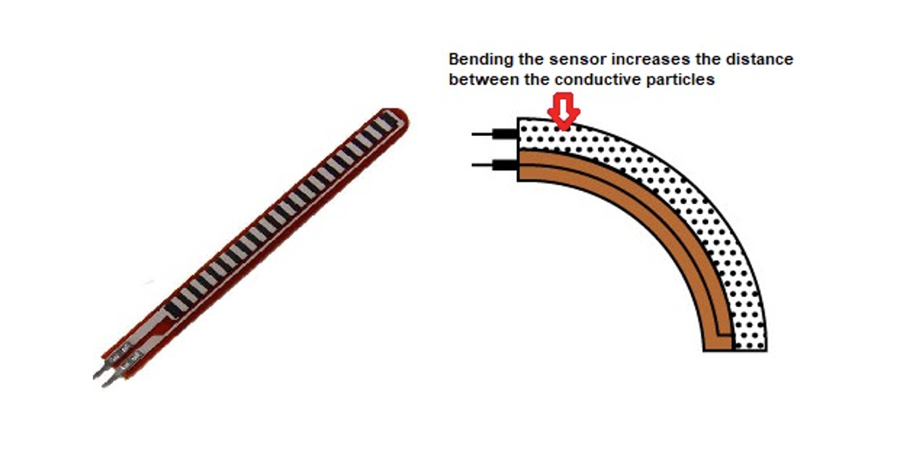
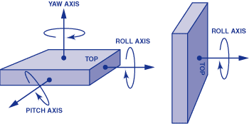

# Knee Rehabilitation Device
<!--
Replace this text with a brief description (2-3 sentences) of your project. This description should draw the reader in and make them interested in what you've built. You can include what the biggest challenges, takeaways, and triumphs from completing the project were. As you complete your portfolio, remember your audience is less familiar than you are with all that your project entails!
-->

| Pratiksha S | Lynbrook High School | Computer Science | Rising Junior |


# Modifications

# Final Milestone
<!--
**Don't forget to replace the text below with the embedding for your milestone video. Go to Youtube, click Share -> Embed, and copy and paste the code to replace what's below.**

<iframe width="560" height="315" src="https://www.youtube.com/embed/F7M7imOVGug" title="YouTube video player" frameborder="0" allow="accelerometer; autoplay; clipboard-write; encrypted-media; gyroscope; picture-in-picture; web-share" allowfullscreen></iframe>

For your final milestone, explain the outcome of your project. Key details to include are:
- What you've accomplished since your previous milestone
- What your biggest challenges and triumphs were at BSE
- A summary of key topics you learned about
- What you hope to learn in the future after everything you've learned at BSE

-->

# Second Milestone
<!--
**Don't forget to replace the text below with the embedding for your milestone video. Go to Youtube, click Share -> Embed, and copy and paste the code to replace what's below.**

<iframe width="560" height="315" src="https://www.youtube.com/embed/y3VAmNlER5Y" title="YouTube video player" frameborder="0" allow="accelerometer; autoplay; clipboard-write; encrypted-media; gyroscope; picture-in-picture; web-share" allowfullscreen></iframe>

For your second milestone, explain what you've worked on since your previous milestone. You can highlight:
- Technical details of what you've accomplished and how they contribute to the final goal
- What has been surprising about the project so far
- Previous challenges you faced that you overcame
- What needs to be completed before your final milestone 
-->
<iframe width="560" height="315" src="https://www.youtube.com/embed/-PiUTkNgQGM?si=0JDh3qX_HEXwD2pu" title="YouTube video player" frameborder="0" allow="accelerometer; autoplay; clipboard-write; encrypted-media; gyroscope; picture-in-picture; web-share" referrerpolicy="strict-origin-when-cross-origin" allowfullscreen></iframe>

## Description
&nbsp;
&nbsp;
&nbsp;
&nbsp;
My second milestone overall was to create a working prototype of the knee rehab device. 

&nbsp;
&nbsp;
&nbsp;
&nbsp;
The first thing I did in this milestone was configure my Bluetooth Serial. I added in the ```<BleSerial.h>``` library, a variable called ```ble``` of type ```BleSerial```, and changed all of the original ```Serial.print```/```Serial.println``` commands to ```ble.print```/```ble.println```. This way, the BLESerialnRF52 app on my phone will print out all of the data that was originally printed onto my laptop onto my phone, making accessing data more accessible. In addition, since I connected my ESP32 to the Bluetooth, I was able to connect and power my prototype with an external power source--more specifically, a power bank--and not have to connect my prototype to a computer all the time. This made it easier to test my device because my wires weren't as strained when I connected it to my computer.

&nbsp;
&nbsp;
&nbsp;
&nbsp;
Later in this milestone, I learned how to give the Bluetooth serial commands so it would print specific data and stop doing certain actions. 
For example, when this character is typed into the Bluetooth serial...
- ```p```: Both the flex sensor and accelerometer readings are displayed/
- ```a```: Only the flex sensor values are displayed.
- ```f```: Only the accelerometer values are displayed.
- ```s```: Data is stopped being displayed, and any buzzers that were buzzing previously are stopped.
This way, it was much easier to read the values and verify that each component is working individually. I am planning to add more commands like these to activate my future modifications.
I also made the Bluetooth serial print out ```"Accelerometer: Bad form detected!"``` and ```"Flex sensor: Bad form detected!"``` at appropriate times.

&nbsp;
&nbsp;
&nbsp;
&nbsp;
What I focused the most on during this milestone is figuring out accurate thresholds for my accelerometer to be able to detect when my knee is bending inward while doing a squat. I tried various things to determine my thresholds, but the technique I stuck to in my final code was using a Logistic Regression Model from Google Colab. Logistic Regression is a machine learning method that finds the relationship between an independent variable and a dependent variable and creates a line of best fit to represent the data given to it. So, I did squats in proper form, where my knee wasn't bending inward, and did squats in improper form, where my knee was bending inward and observed how the X, Y, and Z axes were changing. On a Google Sheet, I recorded the three values on 10 different occasions I did a squat in improper form and 10 other occasions where I did a squat in proper form. I also created a 4th column to label the rows as either 'good' or 'bad.' Then, I downloaded the data as a ```.csv``` file and uploaded it to the Google Colab code to give the machine learning model simple and readable data. I also included the line ```df['label'] = df['label'].map({'good': 1, 'bad': 0})``` so the model reads 'good' as 1 and 'bad' as 0. When I ran the code, the output gave me the coefficients and the intercept of the regression equation ```y = a*x + b*y + c*z + d```. Then, I put this equation into my code to calculate a probability value using the logistic equation ```probability = 1.0 / (1.0 + exp(-linearSum));```. This formula converts the linear sum into a value that is between 0 and 1. If the value is greater than 0.5, then the model is more confident that the squat form is good. If the valueis less than 0.5, then the model is more confident that the squt form is bad. So, I used this 0.5 value as a threshold for determining when to buzz the buzzer associated with the accelerometer to alert of improper form.

&nbsp;
&nbsp;
&nbsp;
&nbsp;
Finally, I soldered my flex sensor pins to two wires so I could determine a threshold for it. Then, I used a rubber banded to secure it to the back of my brace to make sure my device worked.

## Challenges
&nbsp;
&nbsp;
&nbsp;
&nbsp;
At first, I noticed that the BLE Serial app on my phone was not displaying the values of the gyroscope correctly because it was cutting off half of the message, but later on, I realized that the messages were printing too fast. So, the problem was resolved after I added a few delays in between messages being printed.

&nbsp;
&nbsp;
&nbsp;
&nbsp;
My biggest problem during this milestone was making sure my accelerometer was accurate. At first, I was trying to use the X and Y axes of the gyroscope as the threshold for the bend of the knee because it measures angular velocity, which is the rate of rotation of an object around a particular axis. I thought this would be the best way to detect the inward bend of my knee, but I kept getting values that fluctuated between negative and positive decimals, making it difficult to define a clear, consistent threshold. 
Then, I tried using the X and Y axes of the accelerometer instead. As I observed the values while doing multiple squats, I noticed a general pattern that the values were decreasing over time as I continued doing reps. So, I figured I had to make a regression model to learn the pattern of my data and use it to classify good and bad squats.

## Next Steps
&nbsp;
&nbsp;
&nbsp;
&nbsp;
My next steps are to add more modfications to my project and sew everything together onto my brace.

# First Milestone
<!--
**Don't forget to replace the text below with the embedding for your milestone video. Go to Youtube, click Share -> Embed, and copy and paste the code to replace what's below.**

<iframe width="560" height="315" src="https://www.youtube.com/embed/CaCazFBhYKs" title="YouTube video player" frameborder="0" allow="accelerometer; autoplay; clipboard-write; encrypted-media; gyroscope; picture-in-picture; web-share" allowfullscreen></iframe>

For your first milestone, describe what your project is and how you plan to build it. You can include:
- An explanation about the different components of your project and how they will all integrate together
- Technical progress you've made so far
- Challenges you're facing and solving in your future milestones
- What your plan is to complete your project
-->
<iframe width="560" height="315" src="https://www.youtube.com/embed/7I427EQxpsU?si=inD3CkVD_oA9nTMT" title="YouTube video player" frameborder="0" allow="accelerometer; autoplay; clipboard-write; encrypted-media; gyroscope; picture-in-picture; web-share" referrerpolicy="strict-origin-when-cross-origin" allowfullscreen></iframe>

## Description
&nbsp; 
&nbsp;
&nbsp;
&nbsp;
My first milestone was to learn how to calibrate a flex sensor, an accelerometer, and buzzers with an ESP32. When the flex sensor's flexADC value is below a certain number (approximately what looks like 90 degrees to the naked eye), one buzzer will buzz continuously and the serial monitor prints out "Flex Sensor: Bad form detected!" I also tried sampling the data the flex sensor was outputing in attempt to make the data more accurate. I did this by reading ten values from the flex sensor at intervals of 0.01 seconds, finding the average of them, and print out that average. For the accelerometer, I used the example code provided by Arduino IDE (found when you go to 'File' and then press 'Examples') and added the logic to play the buzzer at a specific time. When the adafruit accelerometer's X-axis acceleration value is below a certain number, another buzzer, different from the one used for the flex sensor, will buzz in a different pattern, and the serial monitor prints out "Accelerometer: Bad form detected!" I also learned how to print out the outputs that were originally displayed on the Serial Monitor on my laptop onto an app on my phone called BLESerialnRF52.
## Challenges
&nbsp;
&nbsp;
&nbsp;
&nbsp;
Calibrating the accelerometer was one of the biggest challenges for me. One thing I did not pay attention to that set me back a little was that I downloaded the libraries and used the example code for the wrong accelerometer. The example code for the Adafruit LSM6DS3+LIS3MDL Accelerometer did not work as it was, so I had to tweak it a bit by uncommenting and changing line and downloading the necessary libraries. I also figured out that a 9600 baud rate wasn't suitable for the accelerometer and would either print out random symbols onto the serial monitor or nothing at all, so I changed all my code to begin the serial with a 112500 baud rate. The baud rate refers to the speed of data transmission, so a higher baud rate would be needed for the accelerometer because it generates data at high frequencies.
## Next Steps
&nbsp;
&nbsp;
&nbsp;
&nbsp;
The thresholds that I have currently initialized for the flex sensor and the accelerometer are estimates I defined based on the naked eye, so my next steps would be to make these thresholds more accurate by temporarily taping all of my components to a knee brace, creating a prototype.

# Starter Project Milestone

<iframe width="560" height="315" src="https://www.youtube.com/embed/OkP_cfM5t3o?si=ZXIxwUmzVvw81dvx" title="YouTube video player" frameborder="0" allow="accelerometer; autoplay; clipboard-write; encrypted-media; gyroscope; picture-in-picture; web-share" referrerpolicy="strict-origin-when-cross-origin" allowfullscreen></iframe>

## Description
&nbsp;
&nbsp;
&nbsp;
&nbsp;
My starter project was the Jitterbug. It used a lithium battery to power the device, a vibration motor that turns on using a switch system, two red LED lights, and metal wire for the legs of the Jitterbug. These pieces were mounted and soldered together on a circuit board. When the switch is turned on, the current within the board is able to flow from the battery, powering the LED lights and the vibration motor. The Jitterbug then moves in a circular motion on smooth surfaces.
## Challenges
&nbsp;
&nbsp;
&nbsp;
&nbsp;
I faced numerous challenges while working on this project. I had a lot of trouble soldering the pieces together properly. When I was soldering the wires of the vibration motor, I accidentally created a short between them. I figured this out after using a multimeter by measuring the resistance between the two joints. So, I learned how to desolder the short using the desoldering pump. Eventually, I figured out that my soldering iron wasn't working well, so I switched to a new one, which made soldering much more easy and neat. As someone who has no experience in working with hardware, I found this project a little confusing at first, but I ended up learning a lot by the time I was finished. 
## Next Steps
&nbsp;
&nbsp;
&nbsp;
&nbsp;
This project allowed me to gain significant experience in soldering and wiring logic. I will be needing these skills for my next step--my intensive project, the knee rehabilitation device.

# Flex Sensor
<!--
Here's where you'll put images of your schematics. [Tinkercad](https://www.tinkercad.com/blog/official-guide-to-tinkercad-circuits) and [Fritzing](https://fritzing.org/learning/) are both great resoruces to create professional schematic diagrams, though BSE recommends Tinkercad becuase it can be done easily and for free in the browser. 
-->
&nbsp;
&nbsp;
&nbsp;
&nbsp;
In my project, I needed a way to measure much my knee bends while doing a squat. A flex sensor is perfect for this task. 

&nbsp;
&nbsp;
&nbsp;
&nbsp;
A flex sensor is a type of variable resistor that changes its electrical resistance based on how much it is bent. When the sensor is straight, it has a lower resistance, and as it bends, the resistance increases. 

<div align="center">
  
</div>

&nbsp;
&nbsp;
&nbsp;
&nbsp;
This change in resistance can be measured and read by a microcontroller--in my case, an ESP32-WROOM--using a voltage divider circuit _(see Apendix B)_. I connected the flex sensor to the analog pin, pin number 26 on the ESP32. I chose GPIO 26 because it supports analog input, which is essential for this flex to be able to read the changing resistance values of the flex sensor.

&nbsp;
&nbsp;
&nbsp;
&nbsp;
In the code, I read the sensor values using the analogRead() function on pin 26:

&nbsp;
&nbsp;
&nbsp;
&nbsp;
```int flexADC = analogRead(flexPin);  // flexPin = 26```

&nbsp;
&nbsp;
&nbsp;
&nbsp;
The analog values read from the sensor are stored in the variable ```flexADC```. They range from 0 to 4095 on the ESP32 because it operates with a 12-bit resolution. These 4096 values are used to represent the voltage at the analog input pin. So, by default, 0 volts is converted to the digital value 0 and 3.3 volts is converted to the digital value of 4095.

&nbsp;
&nbsp;
&nbsp;
&nbsp;
In my knee rehab device, I placed the flex sensor behind the knee because measuring the inner bend of the knee would provide more accurate values. As I perform a squat, the sensor bends along with my knee, and the ESP32 reads the corresponding flexADC values in real time. This way, I was able to determine specific flexADC thresholds to track how deep the squat is.

# Adafruit LSM6DS3 + LIS3MDL Accelerometer
&nbsp;
&nbsp;
&nbsp;
&nbsp;
In my project, I needed a way to detect if my knee bends inwards during a squat, so I needed a sensor that would be able to track values that differ from when I do a proper squat versus an improper squat. The Adafruit LSM6DS3 + LIS3MDL Accelerometer is suitable for this.

&nbsp;
&nbsp;
&nbsp;
&nbsp;
The Adafruit Accelerometer is an accelerometer module that detects the accerelation through an acclerometer, the angular velocity through a gyroscop, and the temperature through a magnetometer. The accelerometer and gyroscope read three dimensions, the X, Y, and Z axes.

<div align="center">
  
</div>

# Logistic Regression Model

Code:
```cpp
import pandas as pd
import io
from sklearn.linear_model import LogisticRegression

df = pd.read_csv(io.BytesIO(uploaded['accel_data - Sheet1 (2).csv']))

df['label'] = df['label'].map({'good': 1, 'bad': 0})

X = df[['x', 'y', 'z']]  # Features
y = df['label']          # Output (0 or 0)

model = LogisticRegression()
model.fit(X, y)


print("Coefficients (weights):", model.coef_)
print("Intercept:", model.intercept_)
```

Output:
```cpp
Coefficients (weights): [[ 0.28821893  0.92750543 -1.60632781]]
Intercept: [0.49655361]
```


# Bill of Materials
<!--
Here's where you'll list the parts in your project. To add more rows, just copy and paste the example rows below.
Don't forget to place the link of where to buy each component inside the quotation marks in the corresponding row after href =. Follow the guide [here]([url](https://www.markdownguide.org/extended-syntax/)) to learn how to customize this to your project needs. 
-->

| **Part** | **Note** | **Price** | **Link** |
|:--:|:--:|:--:|:--:|
| ESP-WROOM-32 | What the item is used for | $Price | <a href="https://www.amazon.com/Arduino-A000066-ARDUINO-UNO-R3/dp/B008GRTSV6/"> Link </a> |
| Adafruit LSM6DS3+LIS3MDL Accelerometer | What the item is used for | $Price | <a href="https://www.amazon.com/Arduino-A000066-ARDUINO-UNO-R3/dp/B008GRTSV6/"> Link </a> |
| Flex Sensor (4.5”) | What the item is used for | $Price | <a href="https://www.amazon.com/Arduino-A000066-ARDUINO-UNO-R3/dp/B008GRTSV6/"> Link </a> |
| Knee Compression Sleeve | What the item is used for | $Price | <a href="https://www.amazon.com/Arduino-A000066-ARDUINO-UNO-R3/dp/B008GRTSV6/"> Link </a> |
| 5000 mAh Power Bank (10 cm x 3 cm) | What the item is used for | $Price | <a href="https://www.amazon.com/Arduino-A000066-ARDUINO-UNO-R3/dp/B008GRTSV6/"> Link </a> |
| Neoprene fabric (2” x 6”) | What the item is used for | $Price | <a href="https://www.amazon.com/Arduino-A000066-ARDUINO-UNO-R3/dp/B008GRTSV6/"> Link </a> |
| Sewing Kit | What the item is used for | $Price | <a href="https://www.amazon.com/Arduino-A000066-ARDUINO-UNO-R3/dp/B008GRTSV6/"> Link </a> |
| Jumper Wires | What the item is used for | $Price | <a href="https://www.amazon.com/Arduino-A000066-ARDUINO-UNO-R3/dp/B008GRTSV6/"> Link </a> |
| USB cable for ESP32 | What the item is used for | $Price | <a href="https://www.amazon.com/Arduino-A000066-ARDUINO-UNO-R3/dp/B008GRTSV6/"> Link </a> |
| PCB Board | What the item is used for | $Price | <a href="https://www.amazon.com/Arduino-A000066-ARDUINO-UNO-R3/dp/B008GRTSV6/"> Link </a> |
| Piezo Buzzer | What the item is used for | $Price | <a href="https://www.amazon.com/Arduino-A000066-ARDUINO-UNO-R3/dp/B008GRTSV6/"> Link </a> |
| 10k Ohm Resistor | What the item is used for | $Price | <a href="https://www.amazon.com/Arduino-A000066-ARDUINO-UNO-R3/dp/B008GRTSV6/"> Link </a> |
| 100 Ohm Resistor | What the item is used for | $Price | <a href="https://www.amazon.com/Arduino-A000066-ARDUINO-UNO-R3/dp/B008GRTSV6/"> Link </a> |

# Other Resources/Examples
<!--
One of the best parts about Github is that you can view how other people set up their own work. Here are some past BSE portfolios that are awesome examples. You can view how they set up their portfolio, and you can view their index.md files to understand how they implemented different portfolio components.
- [Example 1](https://trashytuber.github.io/YimingJiaBlueStamp/)
- [Example 2](https://sviatil0.github.io/Sviatoslav_BSE/)
- [Example 3](https://arneshkumar.github.io/arneshbluestamp/)

To watch the BSE tutorial on how to create a portfolio, click here.
-->
- [Flex Sensor Hookup Guide](https://learn.sparkfun.com/tutorials/flex-sensor-hookup-guide/all)
- [Adafruit LSM6DS3TR-C LIS3MD Overview](https://learn.adafruit.com/adafruit-lsm6ds3tr-c-lis3mdl-precision-9-dof-imu/overview)
- [Arduino LSM6DS3 Example Code](https://docs.arduino.cc/libraries/arduino_lsm6ds3/)
- [Logistic Regression Model](https://colab.research.google.com/github/diannekrouse/LRPython/blob/master/LogisticRegression.ipynb)
- [Vibration Motor Hookup](https://www.circuito.io/app?components=513,8449,360217) 

# Appendix A
## Milestone 1
### Flex Sensor
```c++

const int flexPin = 26;
const int flexBuzzer = 33;
const int num = 10; // sampling every 10 data points

void setup() {
  Serial.begin(9600);
  pinMode(flexPin, INPUT);
  pinMode(flexBuzzer, OUTPUT);
}

void loop() {
  int sum = 0;
  for (int i = 0; i < num; i++) {
    sum += analogRead(flexPin);
    delay(10);
  }

  int flexADC = sum/num; // find average of values to determine more accurate data points

  if (flexADC < 620) { // threshold will be made more accurate in next milestone
    tone(flexBuzzer, 1000); // buzzer plays
  } else {
    noTone(flexBuzzer);
  }

  Serial.println(flexADC); // print values of flex sensor

  delay(500);
}
```

### Accelerometer
```c++
#include <Adafruit_BusIO_Register.h>
#include <Adafruit_GenericDevice.h>
#include <Adafruit_I2CDevice.h>
#include <Adafruit_I2CRegister.h>
#include <Adafruit_SPIDevice.h>

#include <Adafruit_LIS3MDL.h>

#include <Adafruit_ISM330DHCX.h>
#include <Adafruit_LSM6DS.h>
#include <Adafruit_LSM6DS3.h>
#include <Adafruit_LSM6DS33.h>
#include <Adafruit_LSM6DS3TRC.h>
#include <Adafruit_LSM6DSL.h>
#include <Adafruit_LSM6DSO32.h>
#include <Adafruit_LSM6DSOX.h>

#include <Adafruit_Sensor.h>

#include <BleSerial.h>

// Basic demo for accelerometer/gyro readings from Adafruit LSM6DS33

// For SPI mode, we need a CS pin
#define LSM_CS 10
// For software-SPI mode we need SCK/MOSI/MISO pins
#define LSM_SCK 13
#define LSM_MISO 12
#define LSM_MOSI 11

Adafruit_LSM6DS33 lsm6ds33;

const int accelBuzzer = 32;
const int flexPin = 26;
const int flexBuzzer = 33;
const int num = 10; // for samplng data
const int flexADCThreshold = 620;

void setup(void) {
  Serial.begin(115200);
  pinMode(accelBuzzer, OUTPUT);
  pinMode(flexPin, INPUT);
  pinMode(flexBuzzer, OUTPUT);
  

  while (!Serial)
    delay(10); // will pause Zero, Leonardo, etc until serial console opens

  Serial.println("Adafruit LSM6DS33 test!");

  // find accelerometer chips
  if (lsm6ds33.begin_I2C()) {
    Serial.println("Finding LSM6DS33 chip");
    while (1) {
      delay(10);
    }
  }

  Serial.println("LSM6DS33 Found!");

  // set range of accelerometer
  lsm6ds33.setAccelRange(LSM6DS_ACCEL_RANGE_2_G);
  Serial.print("Accelerometer range set to: ");
  switch (lsm6ds33.getAccelRange()) {
  case LSM6DS_ACCEL_RANGE_2_G:
    Serial.println("+-2G");
    break;
  case LSM6DS_ACCEL_RANGE_4_G:
    Serial.println("+-4G");
    break;
  case LSM6DS_ACCEL_RANGE_8_G:
    Serial.println("+-8G");
    break;
  case LSM6DS_ACCEL_RANGE_16_G:
    Serial.println("+-16G");
    break;
  }

  // set range of gyroscope
  lsm6ds33.setGyroRange(LSM6DS_GYRO_RANGE_250_DPS);
  Serial.print("Gyro range set to: ");
  switch (lsm6ds33.getGyroRange()) {
  case LSM6DS_GYRO_RANGE_125_DPS:
    Serial.println("125 degrees/s");
    break;
  case LSM6DS_GYRO_RANGE_250_DPS:
    Serial.println("250 degrees/s");
    break;
  case LSM6DS_GYRO_RANGE_500_DPS:
    Serial.println("500 degrees/s");
    break;
  case LSM6DS_GYRO_RANGE_1000_DPS:
    Serial.println("1000 degrees/s");
    break;
  case LSM6DS_GYRO_RANGE_2000_DPS:
    Serial.println("2000 degrees/s");
    break;
  case ISM330DHCX_GYRO_RANGE_4000_DPS:
    break; // unsupported range for the DS33
  }

  // set accelerometer data rate
  lsm6ds33.setAccelDataRate(LSM6DS_RATE_12_5_HZ);
  Serial.print("Accelerometer data rate set to: ");
  switch (lsm6ds33.getAccelDataRate()) {
  case LSM6DS_RATE_SHUTDOWN:
    Serial.println("0 Hz");
    break;
  case LSM6DS_RATE_12_5_HZ:
    Serial.println("12.5 Hz");
    break;
  case LSM6DS_RATE_26_HZ:
    Serial.println("26 Hz");
    break;
  case LSM6DS_RATE_52_HZ:
    Serial.println("52 Hz");
    break;
  case LSM6DS_RATE_104_HZ:
    Serial.println("104 Hz");
    break;
  case LSM6DS_RATE_208_HZ:
    Serial.println("208 Hz");
    break;
  case LSM6DS_RATE_416_HZ:
    Serial.println("416 Hz");
    break;
  case LSM6DS_RATE_833_HZ:
    Serial.println("833 Hz");
    break;
  case LSM6DS_RATE_1_66K_HZ:
    Serial.println("1.66 KHz");
    break;
  case LSM6DS_RATE_3_33K_HZ:
    Serial.println("3.33 KHz");
    break;
  case LSM6DS_RATE_6_66K_HZ:
    Serial.println("6.66 KHz");
    break;
  }

  // set gyroscope data rate
  lsm6ds33.setGyroDataRate(LSM6DS_RATE_12_5_HZ);
  Serial.print("Gyro data rate set to: ");
  switch (lsm6ds33.getGyroDataRate()) {
  case LSM6DS_RATE_SHUTDOWN:
    Serial.println("0 Hz");
    break;
  case LSM6DS_RATE_12_5_HZ:
    Serial.println("12.5 Hz");
    break;
  case LSM6DS_RATE_26_HZ:
    Serial.println("26 Hz");
    break;
  case LSM6DS_RATE_52_HZ:
    Serial.println("52 Hz");
    break;
  case LSM6DS_RATE_104_HZ:
    Serial.println("104 Hz");
    break;
  case LSM6DS_RATE_208_HZ:
    Serial.println("208 Hz");
    break;
  case LSM6DS_RATE_416_HZ:
    Serial.println("416 Hz");
    break;
  case LSM6DS_RATE_833_HZ:
    Serial.println("833 Hz");
    break;
  case LSM6DS_RATE_1_66K_HZ:
    Serial.println("1.66 KHz");
    break;
  case LSM6DS_RATE_3_33K_HZ:
    Serial.println("3.33 KHz");
    break;
  case LSM6DS_RATE_6_66K_HZ:
    Serial.println("6.66 KHz");
    break;
  }

  lsm6ds33.configInt1(false, false, true); // accelerometer DRDY on INT1
  lsm6ds33.configInt2(false, true, false); // gyro DRDY on INT2
}

void loop() {

  // Declare sensor event objects to store data from accelerometer, gyroscope, and magnetometer
  sensors_event_t accel; // accelerometer readings (x, y, z)
  sensors_event_t gyro; // gyroscope readings (x, y, z)
  sensors_event_t temp; // temperature reading
  lsm6ds33.getEvent(&accel, &gyro, &temp); // read sensor data in real time

  Serial.print("\t\tTemperature ");
  Serial.print(temp.temperature);
  Serial.println(" deg C");

  /* Display the results (acceleration is measured in m/s^2) */
  Serial.print("\t\tAccel X: ");
  Serial.print(accel.acceleration.x);
  Serial.print(" \tY: ");
  Serial.print(accel.acceleration.y);
  Serial.print(" \tZ: ");
  Serial.print(accel.acceleration.z);
  Serial.println(" m/s^2 ");

  /* Display the results (rotation is measured in rad/s) */
  Serial.print("\t\tGyro X: ");
  Serial.print(gyro.gyro.x);
  Serial.print(" \tY: ");
  Serial.print(gyro.gyro.y);
  Serial.print(" \tZ: ");
  Serial.print(gyro.gyro.z);
  Serial.println(" radians/s ");

  delay(100);


  float accelXThreshold = -0.40; // estimated threshold

  bool badForm = false;

  if (accel.acceleration.x < accelXThreshold) {
    badForm = true;
  }

  if (badForm == true) {
    // buzzer pattern for accelerometer
    tone(accelBuzzer, 1000);
    Serial.println("\t\tAccelerometer: Bad form detected!");
    Serial.println();
    delay(250);   
    noTone(accelBuzzer);
    delay(100);
    tone(accelBuzzer, 1000);
    delay(250);          
    noTone(accelBuzzer);
    delay(500);
  } else {
    noTone(accelBuzzer);
  }

  delay(500);
}
```

## Milestone 2
```cpp
// Basic demo for accelerometer/gyro readings from Adafruit LSM6DS33

// For SPI mode, we need a CS pin
#define LSM_CS 10
// For software-SPI mode we need SCK/MOSI/MISO pins
#define LSM_SCK 13
#define LSM_MISO 12
#define LSM_MOSI 11

Adafruit_LSM6DS33 lsm6ds33;
BleSerial ble; // variable needed to communicate with BLE serial modules

const int accelBuzzer = 32;
const int flexPin = 26;
const int flexBuzzer = 33;
const int num = 10; // for averaging data
const int flexADCThreshold = 710;

bool badFormFlex = false;
bool badFormAccel = false;

bool printEnabled = false;
bool printFlex = false;
bool printAccel = false;

void setup(void) {
  Serial.begin(115200);
  pinMode(accelBuzzer, OUTPUT);
  pinMode(flexPin, INPUT);
  pinMode(flexBuzzer, OUTPUT);
  ble.begin("Pratiksha'sBleSerialTest");

  while (!Serial)
    delay(10);

  ble.println("Adafruit LSM6DS33 test!");

  if (lsm6ds33.begin_I2C()) {
    ble.println("Finding LSM6DS33 chip");
    while (1) {
      delay(10);
    }
  }

  ble.println("LSM6DS33 Found!");

  lsm6ds33.setAccelRange(LSM6DS_ACCEL_RANGE_2_G);
  ble.print("Accelerometer range set to: ");
  switch (lsm6ds33.getAccelRange()) {
  case LSM6DS_ACCEL_RANGE_2_G:
    ble.println("+-2G");
    break;
  case LSM6DS_ACCEL_RANGE_4_G:
    ble.println("+-4G");
    break;
  case LSM6DS_ACCEL_RANGE_8_G:
    ble.println("+-8G");
    break;
  case LSM6DS_ACCEL_RANGE_16_G:
    ble.println("+-16G");
    break;
  }

  lsm6ds33.setGyroRange(LSM6DS_GYRO_RANGE_250_DPS);
  ble.print("Gyro range set to: ");
  switch (lsm6ds33.getGyroRange()) {
  case LSM6DS_GYRO_RANGE_125_DPS:
    ble.println("125 degrees/s");
    break;
  case LSM6DS_GYRO_RANGE_250_DPS:
    ble.println("250 degrees/s");
    break;
  case LSM6DS_GYRO_RANGE_500_DPS:
    ble.println("500 degrees/s");
    break;
  case LSM6DS_GYRO_RANGE_1000_DPS:
    ble.println("1000 degrees/s");
    break;
  case LSM6DS_GYRO_RANGE_2000_DPS:
    ble.println("2000 degrees/s");
    break;
  case ISM330DHCX_GYRO_RANGE_4000_DPS:
    break; 
  }

  lsm6ds33.setAccelDataRate(LSM6DS_RATE_12_5_HZ);
  ble.print("Accelerometer data rate set to: ");
  switch (lsm6ds33.getAccelDataRate()) {
  case LSM6DS_RATE_SHUTDOWN:
    ble.println("0 Hz");
    break;
  case LSM6DS_RATE_12_5_HZ:
    ble.println("12.5 Hz");
    break;
  case LSM6DS_RATE_26_HZ:
    ble.println("26 Hz");
    break;
  case LSM6DS_RATE_52_HZ:
    ble.println("52 Hz");
    break;
  case LSM6DS_RATE_104_HZ:
    ble.println("104 Hz");
    break;
  case LSM6DS_RATE_208_HZ:
    ble.println("208 Hz");
    break;
  case LSM6DS_RATE_416_HZ:
    ble.println("416 Hz");
    break;
  case LSM6DS_RATE_833_HZ:
    ble.println("833 Hz");
    break;
  case LSM6DS_RATE_1_66K_HZ:
    ble.println("1.66 KHz");
    break;
  case LSM6DS_RATE_3_33K_HZ:
    ble.println("3.33 KHz");
    break;
  case LSM6DS_RATE_6_66K_HZ:
    ble.println("6.66 KHz");
    break;
  }

  lsm6ds33.setGyroDataRate(LSM6DS_RATE_12_5_HZ);
  ble.print("Gyro data rate set to: ");
  switch (lsm6ds33.getGyroDataRate()) {
  case LSM6DS_RATE_SHUTDOWN:
    ble.println("0 Hz");
    break;
  case LSM6DS_RATE_12_5_HZ:
    ble.println("12.5 Hz");
    break;
  case LSM6DS_RATE_26_HZ:
    ble.println("26 Hz");
    break;
  case LSM6DS_RATE_52_HZ:
    ble.println("52 Hz");
    break;
  case LSM6DS_RATE_104_HZ:
    ble.println("104 Hz");
    break;
  case LSM6DS_RATE_208_HZ:
    ble.println("208 Hz");
    break;
  case LSM6DS_RATE_416_HZ:
    ble.println("416 Hz");
    break;
  case LSM6DS_RATE_833_HZ:
    ble.println("833 Hz");
    break;
  case LSM6DS_RATE_1_66K_HZ:
    ble.println("1.66 KHz");
    break;
  case LSM6DS_RATE_3_33K_HZ:
    ble.println("3.33 KHz");
    break;
  case LSM6DS_RATE_6_66K_HZ:
    ble.println("6.66 KHz");
    break;
  }

  lsm6ds33.configInt1(false, false, true);
  lsm6ds33.configInt2(false, true, false);

  ble.println("Knee Rehab Device initiated.");
}

void loop() {
  if (ble.available() > 0) {
    char incomingChar = ble.read(); // read user's input from input stream

    if (incomingChar == 'p') { // prints flex sensor and accelerometer values
      printFlex = true;
      printAccel = true;
      ble.println();
      ble.println("Printing data...");
      ble.println();
    } else if (incomingChar == 'f' ) { // prints flex sensor values
      printFlex = true;
      printAccel = false;
      ble.println();
      ble.println("Printing flex sensor readings...");
      ble.println();
    } else if (incomingChar == 'a') {  // prints accelerometer values
      printFlex = false;
      printAccel = true;
      ble.println();
      ble.println("Printing accelerometer readings...");
      ble.println();
    } else if (incomingChar == 's') {  // stops printing
      printFlex = false;
      printAccel = false;
      ble.println();
      ble.println("Printing disabled.");
      ble.println();
      noTone(accelBuzzer);
      noTone(flexBuzzer);
    }

  if (printFlex == true && printAccel == true) {

  sensors_event_t accel;
  sensors_event_t gyro;
  sensors_event_t temp;
  
  lsm6ds33.getEvent(&accel, &gyro, &temp);

  float linearSum = 0.28821893*accel.acceleration.x +  0.92750543*accel.acceleration.y -1.60632781*accel.acceleration.z + 0.49655361;  // coefficients from logistic regression model
  float probability = 1.0 / (1.0 + exp(-linearSum));  // logistic function equation

  ble.print("Temperature ");
  ble.print(temp.temperature);
  ble.println(" deg C");

  delay(50);

  /* Display the results (acceleration is measured in m/s^2) */
  ble.print("Accel X: ");
  ble.print(accel.acceleration.x);
  ble.print(" \tY: ");
  ble.print(accel.acceleration.y);
  ble.print(" \tZ: ");
  ble.print(accel.acceleration.z);
  ble.println(" m/s^2 ");

  delay(100);

  /* Display the results (rotation is measured in rad/s) */
  ble.print("Gyro X: ");
  ble.print(gyro.gyro.x);
  ble.print(" \tY: ");
  ble.print(gyro.gyro.y);
  ble.print(" \tZ: ");
  ble.print(gyro.gyro.z);
  ble.println(" radians/s ");
  ble.println();

  delay(100);

  if (probability < 0.5) { // less than 0.5 means squat is more likely to be in improper form
    badFormAccel = true;
    tone(accelBuzzer, 1000);
    ble.println();
    ble.println("\tAccelerometer: Bad form detected!");
    ble.println();
    delay(200);   
    noTone(accelBuzzer);
    delay(50);
    tone(accelBuzzer, 1000);
    delay(200);          
    noTone(accelBuzzer);
    delay(300);
  } else {
    noTone(accelBuzzer);
  }

  // average flexADC values for increased accuracy of readings
  int sum = 0;
  for (int i = 0; i < num; i++) {
    sum += analogRead(flexPin);
    delay(10);
  }
  
  int flexADC = sum/num;

  if (flexADC < flexADCThreshold) {
    badFormFlex = true;
    ble.println();
    ble.println("\tFlex Sensor: Bad form detected!");
    ble.println();
    tone(flexBuzzer, 1000);
  } else {
    noTone(flexBuzzer);
  }

  delay(100);

  ble.println();
  ble.print("FlexADC value: ");
  ble.println(flexADC);
  ble.println();

  delay(400);

} else if (printFlex == true && printAccel == false) {

  int sum = 0;
  for (int i = 0; i < num; i++) {
    sum += analogRead(flexPin);
    delay(10);
  }
  
  int flexADC = sum/num;

  if (flexADC < flexADCThreshold) {
    badFormFlex = true;
    ble.println();
    ble.println("\tFlex Sensor: Bad form detected!");
    ble.println();
    tone(flexBuzzer, 1000);
  } else {
    noTone(flexBuzzer);
  }

  delay(100);

  ble.println();
  ble.print("FlexADC value: ");
  ble.println(flexADC);
  ble.println();

  delay(400);

} else if (printFlex == false && printAccel == true) {

  sensors_event_t accel;
  sensors_event_t gyro;
  sensors_event_t temp;
  
  lsm6ds33.getEvent(&accel, &gyro, &temp);

  float linearSum = 0.28821893*accel.acceleration.x +  0.92750543*accel.acceleration.y -1.60632781*accel.acceleration.z + 0.49655361;
  float probability = 1.0 / (1.0 + exp(-linearSum)); 

  ble.print("Temperature ");
  ble.print(temp.temperature);
  ble.println(" deg C");

  delay(50);

  /* Display the results (acceleration is measured in m/s^2) */
  ble.print("Accel X: ");
  ble.print(accel.acceleration.x);
  ble.print(" \tY: ");
  ble.print(accel.acceleration.y);
  ble.print(" \tZ: ");
  ble.print(accel.acceleration.z);
  ble.println(" m/s^2 ");

  delay(100);

  /* Display the results (rotation is measured in rad/s) */
  ble.print("Gyro X: ");
  ble.print(gyro.gyro.x);
  ble.print(" \tY: ");
  ble.print(gyro.gyro.y);
  ble.print(" \tZ: ");
  ble.print(gyro.gyro.z);
  ble.println(" radians/s ");
  ble.println();

  delay(100);

  if (probability < 0.5) {
    badFormAccel = true;
    tone(accelBuzzer, 1000);
    ble.println();
    ble.println("\tAccelerometer: Bad form detected!");
    ble.println();
    delay(200);   
    noTone(accelBuzzer);
    delay(50);
    tone(accelBuzzer, 1000);
    delay(200);          
    noTone(accelBuzzer);
    delay(300);
  } else {
    noTone(accelBuzzer);
  }
    }
}
}
```


# Appendix B
## Milestone 1
<div align="center">
  
</div>
